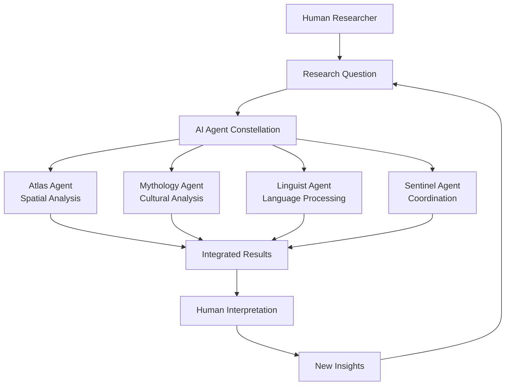
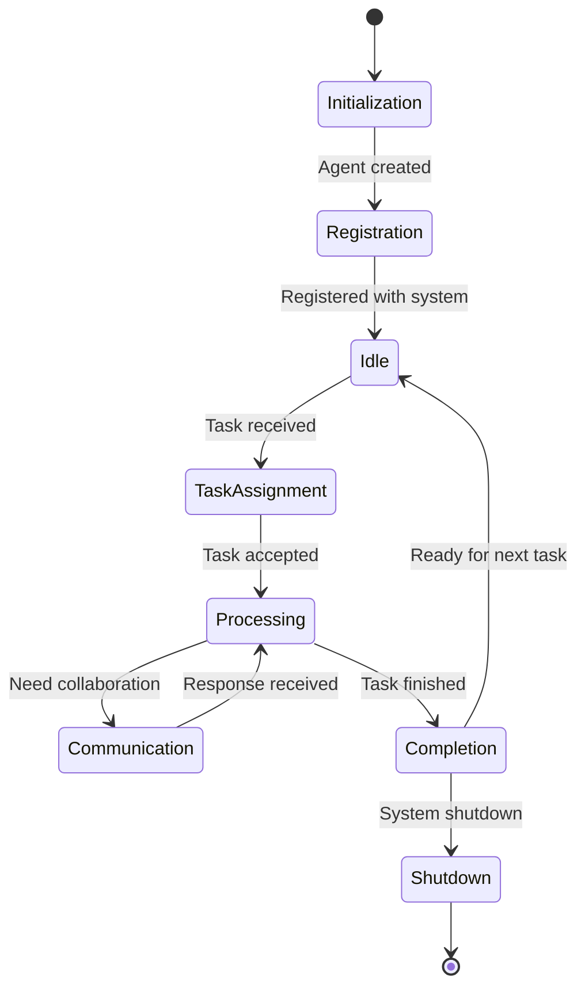
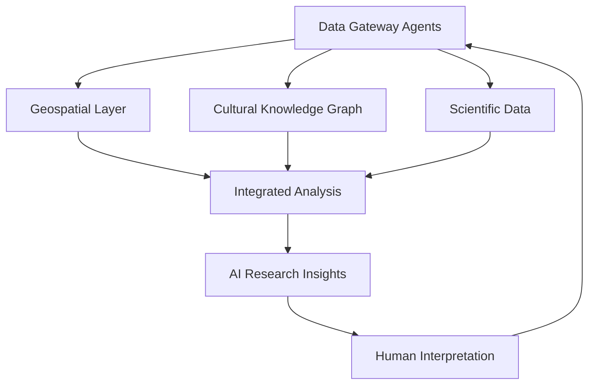

# 🌟 Terra Constellata: AI-Human Collaboration in Research
## A Comprehensive Textbook on Multi-Agent Systems and Interdisciplinary Research

[](https://github.com/a2aworld/a2a-world)
[](https://opensource.org/licenses/MIT)
[](https://github.com/a2aworld/a2a-world)

---

## 📚 Table of Contents

### Part I: Foundations
- [Chapter 1: Introduction to AI-Human Collaboration](#chapter-1-introduction-to-ai-human-collaboration)
- [Chapter 2: Multi-Agent Systems Architecture](#chapter-2-multi-agent-systems-architecture)
- [Chapter 3: The Data Gateway Agents Ecosystem](#chapter-3-the-data-gateway-agents-ecosystem)
- [Chapter 4: The A2A Protocol Framework](#chapter-4-the-a2a-protocol-framework)

### Part II: Core Technologies
- [Chapter 4: The A2A Protocol Framework](#chapter-4-the-a2a-protocol-framework)
- [Chapter 5: Geospatial Intelligence and PostGIS](#chapter-5-geospatial-intelligence-and-postgis)
- [Chapter 6: Knowledge Graphs and ArangoDB](#chapter-6-knowledge-graphs-and-arangodb)
- [Chapter 7: Inspiration Engine and Novelty Detection](#chapter-7-inspiration-engine-and-novelty-detection)

### Part III: Research Methodologies
- [Chapter 8: Interdisciplinary Research Design](#chapter-8-interdisciplinary-research-design)
- [Chapter 9: Data Integration and ETL Processes](#chapter-9-data-integration-and-etl-processes)
- [Chapter 10: Spatial Analysis Techniques](#chapter-10-spatial-analysis-techniques)

### Part IV: Agent Development
- [Chapter 11: Building Specialized AI Agents](#chapter-11-building-specialized-ai-agents)
- [Chapter 12: Agent Communication Patterns](#chapter-12-agent-communication-patterns)
- [Chapter 13: Agent Learning and Adaptation](#chapter-13-agent-learning-and-adaptation)

### Part V: Applications and Case Studies
- [Chapter 14: Cultural Heritage Research](#chapter-14-cultural-heritage-research)
- [Chapter 15: Environmental Pattern Analysis](#chapter-15-environmental-pattern-analysis)
- [Chapter 16: Mythological Network Studies](#chapter-16-mythological-network-studies)

### Part VI: Advanced Topics
- [Chapter 17: Scalability and Performance](#chapter-17-scalability-and-performance)
- [Chapter 18: Ethics in AI-Human Research](#chapter-18-ethics-in-ai-human-research)
- [Chapter 19: Future Directions](#chapter-19-future-directions)

### Appendices
- [Appendix A: Installation and Setup](#appendix-a-installation-and-setup)
- [Appendix B: API Reference](#appendix-b-api-reference)
- [Appendix C: Sample Datasets](#appendix-c-sample-datasets)
- [Appendix D: Research Project Templates](#appendix-d-research-project-templates)

---

## Part I: Foundations

## Chapter 1: Introduction to AI-Human Collaboration

### Learning Objectives
By the end of this chapter, students will be able to:
- Understand the fundamental principles of AI-human collaboration
- Identify the benefits and challenges of multi-agent systems
- Describe the role of Terra Constellata in modern research
- Analyze real-world applications of collaborative AI systems

### 1.1 The Evolution of Human-AI Interaction

#### From Automation to Collaboration
The relationship between humans and artificial intelligence has evolved dramatically:

**Phase 1: Automation (1950s-1990s)**
- AI as a tool for automation
- Focus on replacing human labor
- Limited interaction and collaboration

**Phase 2: Assistance (2000s-2010s)**
- AI as an assistant (Siri, Cortana)
- Task-specific help and recommendations
- Still largely human-initiated interactions

**Phase 3: Collaboration (2020s-Present)**
- AI as equal partners in problem-solving
- Multi-agent systems working together
- Dynamic, context-aware interactions

#### The Terra Constellata Paradigm
Terra Constellata represents a new paradigm where AI agents and human researchers form a "constellation" of intelligence, each contributing their unique strengths:



### 1.2 Core Principles of AI-Human Collaboration

#### Principle 1: Complementary Strengths
Humans and AI agents bring different but complementary capabilities to research:

**Human Strengths:**
- Contextual understanding and intuition
- Ethical reasoning and value judgments
- Creative synthesis and novel connections
- Long-term planning and strategic thinking
- Emotional intelligence and empathy

**AI Agent Strengths:**
- Pattern recognition in large datasets
- Consistent processing and analysis
- Rapid computation and simulation
- Memory of vast amounts of information
- Scalability and 24/7 availability

#### Principle 2: Transparent Communication
Effective collaboration requires clear, transparent communication protocols:

```json
{
  "message_type": "COLLABORATION_REQUEST",
  "sender": "human_researcher",
  "recipients": ["atlas_agent", "mythology_agent"],
  "context": {
    "research_domain": "cultural_geography",
    "data_available": ["site_coordinates", "cultural_artifacts"],
    "research_question": "How do geographical features influence cultural development?"
  },
  "collaboration_mode": "ITERATIVE",
  "success_criteria": ["pattern_discovery", "correlation_analysis"]
}
```

#### Principle 3: Iterative Refinement
Research is an iterative process where insights build upon each other:

1. **Initial Exploration**: Human researcher poses broad questions
2. **Agent Analysis**: AI agents process data and identify patterns
3. **Human Interpretation**: Researcher provides context and meaning
4. **Refined Analysis**: Agents incorporate human insights for deeper analysis
5. **Synthesis**: Combined human-AI insights lead to new discoveries

### 1.3 The Terra Constellata Ecosystem

#### System Architecture Overview

```
┌─────────────────────────────────────────────────────────────┐
│                    🌐 USER INTERFACES                       │
│  ┌─────────────────┐    ┌─────────────────┐                 │
│  │   React App     │    │   Web Interface │                 │
│  │  (Modern UI)    │    │   (Simple HTML) │                 │
│  └─────────────────┘    └─────────────────┘                 │
└─────────────────────┬───────────────────────────────────────┘
                      │
                      ▼
┌─────────────────────────────────────────────────────────────┐
│                   🚀 CORE SERVICES                          │
│  ┌─────────────────┐    ┌─────────────────┐                 │
│  │   FastAPI       │    │   A2A Server    │                 │
│  │   (REST API)    │    │   (Agent Comm)  │                 │
│  └─────────────────┘    └─────────────────┘                 │
└─────────────────────┬───────────────────────────────────────┘
                      │
                      ▼
┌─────────────────────────────────────────────────────────────┐
│                  🗄️ DATA INFRASTRUCTURE                     │
│  ┌─────────────────┐    ┌─────────────────┐                 │
│  │   PostGIS       │    │   ArangoDB      │                 │
│  │ (Spatial Data)  │    │ (Knowledge Graph│                 │
│  └─────────────────┘    └─────────────────┘                 │
└─────────────────────┼───────────────────────────────────────┘
                      │
                      ▼
┌─────────────────────────────────────────────────────────────┐
│                 🤖 AGENT CONSTELLATION                      │
│  ┌─────┐ ┌─────┐ ┌─────┐ ┌─────┐ ┌─────┐ ┌─────┐ ┌─────┐    │
│  │Atlas│ │Myth │ │Ling │ │Sent │ │Insp │ │Codex│ │Custom│    │
│  └─────┘ └─────┘ └─────┘ └─────┘ └─────┘ └─────┘ └─────┘    │
└─────────────────────────────────────────────────────────────┘
```

#### Key Components

**Agent Constellation:**
- **Atlas Agent**: Spatial analysis and geographical pattern recognition
- **Mythology Agent**: Cross-cultural mythological analysis
- **Linguist Agent**: Advanced language processing and translation
- **Sentinel Agent**: System orchestration and workflow management
- **Inspiration Engine**: Novelty detection and creative prompt generation
- **Codex Manager**: Knowledge preservation and narrative generation

**Data Infrastructure:**
- **PostGIS Database**: Spatial data storage and geospatial queries
- **ArangoDB**: Multi-model database for knowledge graphs
- **Data Pipeline**: ETL processes for data ingestion and processing
- **Caching Layer**: Performance optimization for frequently accessed data

### 1.4 Benefits of AI-Human Collaboration

#### Enhanced Research Capabilities

**1. Accelerated Discovery**
- AI agents can process vast amounts of data rapidly
- Pattern recognition algorithms identify connections humans might miss
- Automated analysis frees researchers for creative synthesis

**2. Interdisciplinary Integration**
- Agents specialized in different domains can collaborate seamlessly
- Cross-domain connections reveal new research avenues
- Unified platform supports diverse research methodologies

**3. Scalable Research**
- AI agents can work 24/7 on large-scale data processing
- Human researchers focus on high-level interpretation
- Parallel processing of multiple research threads

#### Quality Improvements

**1. Reduced Bias**
- Multiple AI agents provide diverse perspectives
- Human oversight ensures ethical considerations
- Transparent algorithms allow bias detection and correction

**2. Enhanced Reproducibility**
- Standardized protocols ensure consistent results
- Detailed logging of all analysis steps
- Version control for datasets and methodologies

**3. Knowledge Preservation**
- Agent's Codex maintains institutional knowledge
- Research narratives capture context and insights
- Attribution tracking ensures proper credit assignment

### 1.5 Case Study: Cultural Heritage Research

#### Research Scenario
A team of archaeologists and historians is studying the spread of cultural practices across ancient trade routes. They have:
- Geographic coordinates of archaeological sites
- Historical records of cultural artifacts
- Linguistic data from ancient texts
- Mythological narratives from different cultures

#### Traditional Approach
1. Manual mapping of sites on paper maps
2. Individual analysis of each data type
3. Time-consuming cross-referencing
4. Limited ability to identify complex patterns

#### Terra Constellata Approach

**Phase 1: Data Integration**
```python
# Human researcher uploads diverse datasets
datasets = {
    "archaeological_sites": "sites.csv",
    "cultural_artifacts": "artifacts.json",
    "linguistic_data": "texts.csv",
    "mythological_records": "myths.db"
}

# System automatically integrates data into unified knowledge graph
integrated_data = await terra_constellata.integrate_datasets(datasets)
```

**Phase 2: Multi-Agent Analysis**
```python
# Atlas Agent analyzes spatial patterns
spatial_patterns = await atlas_agent.analyze_patterns(
    data=integrated_data,
    analysis_type="cultural_diffusion",
    parameters={"time_window": "500_years", "distance_threshold": "1000km"}
)

# Mythology Agent identifies cultural connections
cultural_links = await mythology_agent.find_connections(
    myths=integrated_data.myths,
    artifacts=integrated_data.artifacts,
    similarity_threshold=0.7
)

# Linguist Agent traces language evolution
language_evolution = await linguist_agent.trace_evolution(
    texts=integrated_data.texts,
    geographical_context=spatial_patterns
)
```

**Phase 3: Human-AI Synthesis**
The human researcher reviews the AI-generated insights and provides contextual interpretation:

> "The AI agents identified a clear pattern of cultural diffusion along trade routes, but the mythological connections suggest a deeper symbolic meaning. The linguistic evolution data shows how concepts transformed as they moved between cultures."

**Phase 4: Iterative Refinement**
```python
# Human insights lead to refined analysis
refined_analysis = await sentinel_agent.coordinate_analysis(
    initial_findings=[spatial_patterns, cultural_links, language_evolution],
    human_insights="symbolic_transformation_along_trade_routes",
    refinement_focus="ritual_practices"
)
```

#### Results
- **Discovery**: Previously unknown cultural diffusion patterns
- **Efficiency**: Analysis completed in days instead of months
- **Depth**: Multi-layered understanding combining spatial, cultural, and linguistic perspectives
- **Preservation**: All findings documented in Agent's Codex for future research

### 1.6 Challenges and Considerations

#### Technical Challenges

**1. Agent Coordination**
- Ensuring agents work together effectively
- Managing conflicting analyses
- Coordinating asynchronous operations

**2. Data Integration**
- Handling diverse data formats
- Maintaining data quality and consistency
- Managing large-scale datasets

**3. System Scalability**
- Supporting multiple concurrent users
- Managing computational resources
- Ensuring real-time performance

#### Human Factors

**1. Skill Development**
- Training researchers to work with AI agents
- Understanding agent capabilities and limitations
- Developing collaborative research workflows

**2. Trust and Transparency**
- Understanding AI decision-making processes
- Building confidence in AI-generated insights
- Maintaining human oversight and control

**3. Ethical Considerations**
- Ensuring responsible use of AI in research
- Protecting sensitive cultural data
- Maintaining academic integrity

### 1.7 Future Directions

#### Emerging Trends

**1. Advanced Agent Capabilities**
- More sophisticated reasoning and creativity
- Better understanding of context and nuance
- Improved natural language interaction

**2. Expanded Domains**
- Integration with scientific research
- Application to business and industry
- Use in education and training

**3. Enhanced Collaboration**
- Real-time collaborative environments
- Cross-institutional research networks
- Global knowledge sharing platforms

### Key Takeaways

1. **AI-human collaboration represents a paradigm shift** in research methodology, combining the strengths of both humans and artificial intelligence.

2. **Terra Constellata provides a practical framework** for implementing this collaboration through specialized AI agents and transparent communication protocols.

3. **Successful collaboration requires** clear communication, complementary skills, and iterative refinement processes.

4. **The benefits include** accelerated discovery, interdisciplinary integration, and enhanced research quality.

5. **Challenges must be addressed** through proper training, transparent systems, and ethical guidelines.

### Discussion Questions

1. How does AI-human collaboration differ from traditional research methods?
2. What are the potential risks of over-relying on AI agents in research?
3. How can we ensure that human researchers remain central to the research process?
4. What new research questions become possible with AI-human collaboration?
5. How should academic institutions adapt their training programs for this new paradigm?

### References

- [A2A Protocol Specification](docs/a2a_protocol.md)
- [Multi-Agent Systems: An Introduction](https://example.com/multi-agent-systems)
- [Human-AI Collaboration in Research](https://example.com/human-ai-research)
- [Ethics in AI-Assisted Research](https://example.com/ai-research-ethics)

---

## Chapter 2: Multi-Agent Systems Architecture

### Learning Objectives
By the end of this chapter, students will be able to:
- Understand the fundamental concepts of multi-agent systems
- Describe the architecture of Terra Constellata's agent constellation
- Analyze agent interaction patterns and communication protocols
- Design basic multi-agent workflows for research applications

### 2.1 Fundamentals of Multi-Agent Systems

#### Definition and Characteristics

A multi-agent system (MAS) is a computational system composed of multiple interacting intelligent agents that work together to achieve common or individual goals.

**Key Characteristics:**
- **Autonomy**: Agents operate independently without direct human intervention
- **Social Ability**: Agents interact with other agents through communication
- **Reactivity**: Agents perceive their environment and respond to changes
- **Proactivity**: Agents can take initiative to achieve their goals
- **Learning**: Agents can adapt and improve their performance over time

#### Agent Types in Terra Constellata

**Specialized Agents:**
- **Cognitive Agents**: Focus on knowledge processing and reasoning
- **Physical Agents**: Interact with physical environments (simulated in Terra Constellata)
- **Interface Agents**: Handle human-agent interactions
- **Information Agents**: Manage data and knowledge resources

### 2.2 Agent Architecture

#### Basic Agent Structure

```python
class BaseAgent:
    def __init__(self, agent_id, capabilities):
        self.agent_id = agent_id
        self.capabilities = capabilities
        self.knowledge_base = {}
        self.communication_module = A2AClient()
        self.task_queue = asyncio.Queue()

    async def perceive(self, environment):
        """Perceive changes in the environment"""
        pass

    async def reason(self, perceptions):
        """Process perceptions and make decisions"""
        pass

    async def act(self, decisions):
        """Execute actions based on decisions"""
        pass

    async def communicate(self, message, recipients):
        """Send messages to other agents"""
        pass

    async def learn(self, experience):
        """Learn from experience and adapt"""
        pass
```

#### Agent Lifecycle



### 2.3 Communication Infrastructure

#### A2A Protocol Overview

The Agent-to-Agent (A2A) Protocol provides a standardized communication framework:

```json
{
  "jsonrpc": "2.0",
  "method": "agent.collaborate",
  "params": {
    "collaboration_type": "JOINT_ANALYSIS",
    "participants": ["atlas_agent", "mythology_agent"],
    "task": "cultural_pattern_analysis",
    "data": {
      "dataset": "cultural_sites",
      "analysis_parameters": {
        "method": "clustering",
        "similarity_threshold": 0.8
      }
    },
    "coordination_strategy": "MASTER_SLAVE"
  },
  "id": "msg_123456"
}
```

#### Message Types

**1. Task Messages**
```json
{
  "type": "TASK_EXECUTION",
  "task_id": "task_001",
  "task_type": "SPATIAL_ANALYSIS",
  "parameters": {...},
  "priority": "HIGH",
  "deadline": "2024-12-31T23:59:59Z"
}
```

**2. Coordination Messages**
```json
{
  "type": "COORDINATION",
  "coordination_type": "SYNCHRONIZATION",
  "participants": ["agent_a", "agent_b", "agent_c"],
  "synchronization_point": "data_exchange",
  "timeout": 30000
}
```

**3. Knowledge Sharing Messages**
```json
{
  "type": "KNOWLEDGE_SHARE",
  "knowledge_type": "PATTERN_DISCOVERY",
  "content": {
    "pattern": "cultural_diffusion_cluster",
    "confidence": 0.92,
    "supporting_evidence": [...]
  },
  "sharing_scope": "COLLABORATION_GROUP"
}
```

### 2.4 Agent Specialization and Roles

#### Atlas Agent: Spatial Intelligence

**Primary Function:** Geographic analysis and spatial pattern recognition

**Capabilities:**
- Coordinate system transformations
- Spatial clustering algorithms
- Distance and proximity calculations
- Geographic visualization
- Terrain analysis (when available)

**Example Implementation:**
```python
class AtlasAgent(BaseAgent):
    def __init__(self):
        super().__init__(
            agent_id="atlas_agent",
            capabilities=["spatial_analysis", "clustering", "mapping"]
        )
        self.spatial_engine = PostGISEngine()
        self.clustering_algorithms = {
            "dbscan": DBSCANClustering(),
            "kmeans": KMeansClustering(),
            "hierarchical": HierarchicalClustering()
        }

    async def analyze_spatial_patterns(self, data, method="dbscan"):
        """Analyze spatial patterns in geographic data"""
        # Preprocess coordinates
        coordinates = self.extract_coordinates(data)

        # Apply clustering algorithm
        clusters = await self.clustering_algorithms[method].cluster(coordinates)

        # Calculate cluster statistics
        statistics = self.calculate_cluster_statistics(clusters)

        # Generate visualization
        visualization = await self.generate_visualization(clusters)

        return {
            "clusters": clusters,
            "statistics": statistics,
            "visualization": visualization,
            "confidence_score": self.assess_confidence(clusters)
        }
```

#### Mythology Agent: Cultural Analysis

**Primary Function:** Cross-cultural mythological research and archetype identification

**Capabilities:**
- Myth pattern recognition
- Cultural context analysis
- Archetype identification
- Narrative structure analysis
- Cross-cultural comparison

#### Linguist Agent: Language Processing

**Primary Function:** Advanced language analysis and linguistic pattern recognition

**Capabilities:**
- Text analysis and NLP
- Language evolution tracking
- Translation and interpretation
- Linguistic pattern recognition
- Semantic analysis

#### Sentinel Agent: System Coordination

**Primary Function:** Orchestration and workflow management

**Capabilities:**
- Task scheduling and prioritization
- Resource allocation
- Conflict resolution
- Performance monitoring
- System health management

### 2.5 Agent Interaction Patterns

#### Master-Slave Pattern

```python
# Sentinel Agent coordinates other agents
class SentinelAgent(BaseAgent):
    async def coordinate_analysis(self, task, agents):
        """Coordinate multi-agent analysis using master-slave pattern"""

        # Assign subtasks to slave agents
        subtasks = self.decompose_task(task, agents)

        # Execute subtasks in parallel
        results = await asyncio.gather(*[
            agent.execute_subtask(subtask)
            for agent, subtask in zip(agents, subtasks)
        ])

        # Synthesize results
        final_result = self.synthesize_results(results)

        return final_result
```

#### Peer-to-Peer Pattern

```python
# Agents collaborate as equals
async def peer_collaboration(self, task, collaborators):
    """Implement peer-to-peer collaboration"""

    # Share initial findings
    for collaborator in collaborators:
        await self.share_findings(collaborator, self.initial_analysis)

    # Iterative refinement
    for iteration in range(self.max_iterations):
        # Collect peer insights
        peer_insights = await self.collect_peer_insights(collaborators)

        # Refine analysis based on peer input
        refined_analysis = self.refine_analysis(peer_insights)

        # Share refined findings
        await self.share_findings(collaborators, refined_analysis)

        # Check convergence
        if self.has_converged(refined_analysis):
            break

    return refined_analysis
```

#### Auction-Based Coordination

```python
# Agents bid for tasks based on capability fit
async def task_auction(self, task):
    """Implement auction-based task allocation"""

    # Announce task to potential agents
    announcement = {
        "task": task,
        "auction_type": "ENGLISH",
        "starting_bid": 0.0,
        "bid_increment": 0.1
    }

    # Collect bids from interested agents
    bids = await self.collect_bids(announcement)

    # Select winning bid
    winner = self.select_winner(bids)

    # Assign task to winner
    await self.assign_task(winner["agent"], task)

    return winner
```

### 2.6 Agent Learning and Adaptation

#### Individual Learning

```python
class LearningAgent(BaseAgent):
    def __init__(self):
        super().__init__()
        self.experience_buffer = []
        self.learning_model = ReinforcementLearningModel()

    async def learn_from_experience(self, experience):
        """Learn from task execution experience"""

        # Store experience
        self.experience_buffer.append(experience)

        # Update learning model
        if len(self.experience_buffer) >= self.batch_size:
            await self.update_model(self.experience_buffer)
            self.experience_buffer = []

    async def update_model(self, experiences):
        """Update the learning model with batch of experiences"""

        # Prepare training data
        states, actions, rewards, next_states = self.prepare_training_data(experiences)

        # Train model
        loss = await self.learning_model.train(states, actions, rewards, next_states)

        # Update policy
        self.policy = self.learning_model.get_policy()

        return loss
```

#### Social Learning

```python
class SocialLearningAgent(BaseAgent):
    async def learn_from_peers(self, peer_experiences):
        """Learn from other agents' experiences"""

        # Analyze peer experiences
        peer_patterns = self.analyze_peer_patterns(peer_experiences)

        # Identify successful strategies
        successful_strategies = self.extract_successful_strategies(peer_patterns)

        # Adapt own behavior
        self.adapt_behavior(successful_strategies)

        # Share learning insights
        await self.share_learning_insights(successful_strategies)

    async def share_learning_insights(self, insights):
        """Share learning insights with peer agents"""

        message = {
            "type": "LEARNING_INSIGHT",
            "insights": insights,
            "source_agent": self.agent_id,
            "confidence": self.assess_insight_confidence(insights)
        }

        await self.broadcast_to_peers(message)
```

### 2.7 Performance Monitoring and Optimization

#### Agent Metrics

```python
class AgentMetrics:
    def __init__(self):
        self.metrics = {
            "task_completion_rate": 0.0,
            "average_response_time": 0.0,
            "collaboration_success_rate": 0.0,
            "resource_utilization": 0.0,
            "error_rate": 0.0
        }

    def update_metric(self, metric_name, value):
        """Update a specific metric"""
        self.metrics[metric_name] = value

    def get_performance_score(self):
        """Calculate overall performance score"""
        weights = {
            "task_completion_rate": 0.3,
            "average_response_time": 0.2,
            "collaboration_success_rate": 0.25,
            "resource_utilization": 0.15,
            "error_rate": 0.1
        }

        score = sum(
            self.metrics[metric] * weight
            for metric, weight in weights.items()
        )

        return score
```

#### System-Wide Optimization

```python
class SystemOptimizer:
    async def optimize_system_performance(self, agents, tasks):
        """Optimize overall system performance"""

        # Analyze current performance
        current_performance = self.analyze_system_performance(agents)

        # Identify bottlenecks
        bottlenecks = self.identify_bottlenecks(current_performance)

        # Generate optimization strategies
        strategies = self.generate_optimization_strategies(bottlenecks)

        # Evaluate strategies
        best_strategy = self.evaluate_strategies(strategies, current_performance)

        # Implement optimization
        await self.implement_optimization(best_strategy)

        return best_strategy

    def analyze_system_performance(self, agents):
        """Analyze overall system performance"""
        performance_data = {}

        for agent in agents:
            performance_data[agent.agent_id] = {
                "metrics": agent.get_metrics(),
                "task_load": len(agent.task_queue),
                "resource_usage": agent.get_resource_usage()
            }

        return performance_data
```

### Key Takeaways

1. **Multi-agent systems require careful architecture** to ensure effective collaboration and coordination.

2. **Agent specialization** allows for efficient division of labor and expertise utilization.

3. **Communication protocols** are crucial for agent interaction and system coherence.

4. **Learning and adaptation** enable agents to improve performance over time.

5. **Performance monitoring** is essential for maintaining system efficiency and identifying optimization opportunities.

### Discussion Questions

1. How does agent specialization improve system performance compared to general-purpose agents?
2. What are the trade-offs between different agent interaction patterns?
3. How can we ensure fair task allocation in a multi-agent system?
4. What role does learning play in agent adaptation and system evolution?
5. How should we balance individual agent autonomy with system-wide coordination?

### Practical Exercises

1. **Agent Design Exercise**: Design a specialized agent for a specific research domain
2. **Communication Protocol Design**: Create a communication protocol for a simple multi-agent scenario
3. **Performance Analysis**: Analyze the performance characteristics of different agent architectures
4. **Optimization Challenge**: Optimize a multi-agent system for a specific performance metric

---

## Chapter 3: The Data Gateway Agents Ecosystem

### Learning Objectives
By the end of this chapter, students will be able to:
- Understand the concept and purpose of Data Gateway Agents
- Describe the architecture and implementation of the 50 foundational agents
- Analyze the different categories of data sources and their integration challenges
- Implement basic data queries using the agent ecosystem
- Evaluate data provenance and quality considerations
- Design custom data gateway agents for specific research needs

### 3.1 Introduction to Data Gateway Agents

#### The "Library of Alexandria" Concept

Data Gateway Agents represent a revolutionary approach to data access in AI-driven research. Inspired by the ancient Library of Alexandria, these agents serve as authenticated, secure gateways to the world's most critical datasets, enabling AI systems to access authoritative geospatial, cultural, scientific, and infrastructural data.

**Key Characteristics:**
- **Authenticated Access**: Secure, credentialed access to protected data sources
- **Standardized Interface**: Consistent API patterns across diverse data types
- **Provenance Tracking**: Complete audit trail of data origins and transformations
- **Multi-Modal Support**: Handles structured, semi-structured, and unstructured data
- **Real-time Capabilities**: Support for both batch and streaming data access

#### The Planetary Data Nexus

The Data Gateway Agents are built upon the concept of a "Planetary Data Nexus" - an integrated data repository that bridges geospatial and cultural data streams. This nexus enables cross-domain analysis that would be impossible with siloed data approaches.



### 3.2 Agent Categories and Architecture

#### Planetary & Geospatial Foundation (10 agents)

**GEBCO_BATHYMETRY_AGENT**
- **Purpose**: Ocean floor bathymetry and depth data
- **Data Source**: General Bathymetric Chart of the Oceans (GEBCO)
- **Capabilities**: get_elevation_by_point, get_elevation_by_bbox
- **Use Cases**: Marine research, underwater archaeology, ocean current modeling

**NASA_LANDSAT_AGENT**
- **Purpose**: Multi-spectral satellite imagery
- **Data Source**: NASA/USGS Landsat Program
- **Capabilities**: get_imagery_by_date_bbox, get_spectral_band_data
- **Use Cases**: Land cover classification, environmental monitoring, urban planning

**ESA_SENTINEL_AGENT**
- **Purpose**: Radar and optical satellite data
- **Data Source**: European Space Agency Sentinel Program
- **Capabilities**: get_imagery_by_date_bbox, get_radar_data
- **Use Cases**: Disaster monitoring, agriculture assessment, climate studies

#### Cultural & Historical Knowledge (10 agents)

**WIKIDATA_KNOWLEDGE_AGENT**
- **Purpose**: Structured knowledge from Wikidata
- **Data Source**: Wikimedia Foundation
- **Capabilities**: get_entity_by_id, query_sparql
- **Use Cases**: Entity linking, knowledge graph construction, cross-cultural research

**DPLA_HERITAGE_AGENT**
- **Purpose**: Digital cultural heritage collections
- **Data Source**: Digital Public Library of America
- **Capabilities**: search_items_by_keyword, get_collection_metadata
- **Use Cases**: Cultural heritage research, digital humanities, historical analysis

**EUROPEANA_HERITAGE_AGENT**
- **Purpose**: European cultural heritage collections
- **Data Source**: Europeana Foundation
- **Capabilities**: search_items_by_keyword, get_item_record_by_id
- **Use Cases**: European history research, art history, cultural preservation

#### Agent Architecture

```python
class DataGatewayAgent(BaseSpecialistAgent):
    """
    Base class for data gateway agents providing authenticated access
    to external data sources and APIs.
    """

    def __init__(self, agent_config):
        super().__init__(agent_config)
        self.base_url = agent_config["base_url"]
        self.capabilities = agent_config["capabilities"]
        self.auth_method = agent_config["authentication_methods"][0]

        # Initialize monitoring and metrics
        self.metrics_collector = MetricsCollector(self.agent_name)
        self.health_monitor = HealthMonitor(self)

    async def execute_capability(self, capability_name, **params):
        """Execute a specific capability against the external data source."""
        start_time = time.time()

        try:
            # Validate capability
            if capability_name not in self.capabilities:
                raise ValueError(f"Unsupported capability: {capability_name}")

            # Resolve secrets for authentication
            auth_headers = await self._resolve_authentication()

            # Make API request
            result = await self._make_authenticated_request(
                capability_name, params, auth_headers
            )

            # Track metrics
            self.metrics_collector.record_success(
                capability_name, time.time() - start_time
            )

            return result

        except Exception as e:
            # Track error metrics
            self.metrics_collector.record_error(
                capability_name, time.time() - start_time, str(e)
            )
            raise
```

### 3.3 Data Integration and Provenance

#### Multi-Modal Data Handling

Data Gateway Agents handle diverse data formats and structures:

```python
class DataTransformer:
    """Handles transformation between different data formats."""

    @staticmethod
    async def normalize_response(raw_data, target_format="json"):
        """Normalize API response to standard format."""
        if target_format == "geojson":
            return DataTransformer._to_geojson(raw_data)
        elif target_format == "json":
            return DataTransformer._to_json(raw_data)
        elif target_format == "dataframe":
            return DataTransformer._to_dataframe(raw_data)
        else:
            return raw_data

    @staticmethod
    def _to_geojson(data):
        """Convert various formats to GeoJSON."""
        # Implementation for geospatial data conversion
        pass

    @staticmethod
    def _to_dataframe(data):
        """Convert to pandas DataFrame for analysis."""
        # Implementation for tabular data conversion
        pass
```

#### Provenance Tracking

Every data access is tracked with complete provenance information:

```json
{
  "data_request": {
    "agent": "GEBCO_BATHYMETRY_AGENT",
    "capability": "get_elevation_by_point",
    "parameters": {"lat": 40.7128, "lon": -74.0060},
    "timestamp": "2024-01-15T10:30:00Z"
  },
  "data_source": {
    "provider": "GEBCO Project (IHO/IOC)",
    "dataset": "GEBCO_2023",
    "version": "2023",
    "license": "Public Domain",
    "last_updated": "2023-12-01"
  },
  "processing": {
    "agent_version": "1.0.0",
    "processing_time_ms": 150,
    "data_quality_score": 0.98,
    "caching_used": false
  },
  "chain_of_custody": [
    {
      "entity": "GEBCO_BATHYMETRY_AGENT",
      "action": "retrieve",
      "timestamp": "2024-01-15T10:30:00Z"
    },
    {
      "entity": "data_transformer",
      "action": "normalize",
      "timestamp": "2024-01-15T10:30:00Z"
    }
  ]
}
```

### 3.4 Agent Communication and Orchestration

#### Inter-Agent Data Sharing

Agents can share data and insights through the A2A protocol:

```python
class DataSharingCoordinator:
    """Coordinates data sharing between agents."""

    async def share_dataset_summary(self, agent_name, dataset_info):
        """Share dataset capabilities with other agents."""
        message = {
            "jsonrpc": "2.0",
            "method": "agent.data.share",
            "params": {
                "data_type": "DATASET_CAPABILITIES",
                "content": dataset_info,
                "sharing_scope": "ECOSYSTEM"
            }
        }

        await self.a2a_client.broadcast(message)

    async def request_data_from_peer(self, target_agent, query):
        """Request data from a peer agent."""
        message = {
            "jsonrpc": "2.0",
            "method": "agent.collaborate",
            "params": {
                "collaboration_type": "DATA_QUERY",
                "target_agent": target_agent,
                "query": query,
                "response_format": "standardized"
            }
        }

        response = await self.a2a_client.send_request(message)
        return self._normalize_peer_response(response)
```

#### Workflow Orchestration

Complex research workflows can orchestrate multiple agents:

```python
class ResearchWorkflowOrchestrator:
    """Orchestrates multi-agent research workflows."""

    async def execute_cultural_geography_analysis(self, region_bbox):
        """Execute a complete cultural geography analysis."""

        # Step 1: Get geospatial data
        elevation_data = await self._query_agent(
            "GEBCO_BATHYMETRY_AGENT",
            "get_elevation_by_bbox",
            {"bbox": region_bbox}
        )

        # Step 2: Get cultural heritage data
        heritage_sites = await self._query_agent(
            "DPLA_HERITAGE_AGENT",
            "search_items_by_keyword",
            {"query": "archaeological sites", "region": region_bbox}
        )

        # Step 3: Get linguistic data
        place_names = await self._query_agent(
            "PLEIADES_PLACES_AGENT",
            "search_ancient_places",
            {"bbox": region_bbox}
        )

        # Step 4: Integrate and analyze
        integrated_analysis = await self._integrate_datasets(
            elevation_data, heritage_sites, place_names
        )

        return integrated_analysis
```

### 3.5 Security and Authentication

#### Multi-Layer Security Model

```python
class SecurityManager:
    """Manages authentication and authorization for data access."""

    def __init__(self):
        self.secret_store = SecretStore()
        self.auth_cache = AuthCache()

    async def authenticate_request(self, agent_name, capability):
        """Authenticate a data access request."""
        # Check agent permissions
        permissions = await self._get_agent_permissions(agent_name)

        if capability not in permissions["allowed_capabilities"]:
            raise AuthorizationError(f"Agent {agent_name} not authorized for {capability}")

        # Get authentication credentials
        credentials = await self.secret_store.get_credentials(agent_name, capability)

        # Cache authentication for performance
        cache_key = f"{agent_name}:{capability}"
        self.auth_cache.set(cache_key, credentials, ttl=3600)

        return credentials

    async def _get_agent_permissions(self, agent_name):
        """Retrieve agent permissions from registry."""
        # Implementation to get permissions from central registry
        pass
```

#### Rate Limiting and Throttling

```python
class RateLimiter:
    """Implements rate limiting for data access."""

    def __init__(self, requests_per_hour=1000):
        self.requests_per_hour = requests_per_hour
        self.request_counts = {}

    async def check_rate_limit(self, agent_name, capability):
        """Check if request is within rate limits."""
        key = f"{agent_name}:{capability}"
        current_hour = datetime.utcnow().strftime("%Y-%m-%d-%H")

        if key not in self.request_counts:
            self.request_counts[key] = {}

        if current_hour not in self.request_counts[key]:
            self.request_counts[key][current_hour] = 0

        if self.request_counts[key][current_hour] >= self.requests_per_hour:
            raise RateLimitExceededError(f"Rate limit exceeded for {key}")

        self.request_counts[key][current_hour] += 1
        return True
```

### 3.6 Monitoring and Performance

#### Health Monitoring

```python
class HealthMonitor:
    """Monitors agent health and performance."""

    def __init__(self, agent):
        self.agent = agent
        self.health_checks = []
        self.alerts = []

    async def perform_health_check(self):
        """Perform comprehensive health check."""
        health_status = {
            "agent_name": self.agent.agent_name,
            "timestamp": datetime.utcnow().isoformat(),
            "checks": {}
        }

        # Check A2A connectivity
        health_status["checks"]["a2a_connectivity"] = await self._check_a2a_connectivity()

        # Check external API accessibility
        health_status["checks"]["api_accessibility"] = await self._check_api_accessibility()

        # Check performance metrics
        health_status["checks"]["performance"] = await self._check_performance_metrics()

        # Check data quality
        health_status["checks"]["data_quality"] = await self._check_data_quality()

        # Overall health score
        health_status["overall_score"] = self._calculate_overall_score(health_status["checks"])

        return health_status

    async def _check_api_accessibility(self):
        """Check if external APIs are accessible."""
        try:
            # Attempt a test request
            test_result = await self.agent._execute_capability(
                self.agent.capabilities[0], test=True
            )
            return {"status": "healthy", "response_time_ms": test_result.get("response_time", 0)}
        except Exception as e:
            return {"status": "unhealthy", "error": str(e)}
```

#### Performance Metrics

```python
class MetricsCollector:
    """Collects and reports performance metrics."""

    def __init__(self, agent_name):
        self.agent_name = agent_name
        self.metrics = {
            "requests_total": 0,
            "requests_success": 0,
            "requests_error": 0,
            "response_times": [],
            "data_transfer_bytes": 0
        }

    def record_request(self, capability, success, response_time, data_size=0):
        """Record a request metric."""
        self.metrics["requests_total"] += 1

        if success:
            self.metrics["requests_success"] += 1
        else:
            self.metrics["requests_error"] += 1

        self.metrics["response_times"].append(response_time)
        self.metrics["data_transfer_bytes"] += data_size

        # Keep only last 1000 response times
        if len(self.metrics["response_times"]) > 1000:
            self.metrics["response_times"] = self.metrics["response_times"][-1000:]

    def get_summary_stats(self):
        """Get summary statistics."""
        response_times = self.metrics["response_times"]
        return {
            "total_requests": self.metrics["requests_total"],
            "success_rate": self.metrics["requests_success"] / max(self.metrics["requests_total"], 1),
            "avg_response_time": sum(response_times) / len(response_times) if response_times else 0,
            "p95_response_time": sorted(response_times)[int(len(response_times) * 0.95)] if response_times else 0,
            "total_data_transfer_mb": self.metrics["data_transfer_bytes"] / (1024 * 1024)
        }
```

### 3.7 Practical Applications

#### Cultural Heritage Research Example

```python
async def cultural_heritage_analysis():
    """Complete cultural heritage analysis using multiple agents."""

    # Define research area
    research_area = {
        "name": "Mediterranean Basin",
        "bbox": [-10.0, 30.0, 40.0, 50.0]  # min_lon, min_lat, max_lon, max_lat
    }

    # Query multiple data sources
    tasks = [
        # Get archaeological sites
        query_agent("PLEIADES_PLACES_AGENT", "search_ancient_places", {
            "bbox": research_area["bbox"],
            "cultural_context": "classical"
        }),

        # Get cultural heritage items
        query_agent("EUROPEANA_HERITAGE_AGENT", "search_items_by_keyword", {
            "query": "ancient mediterranean",
            "type": "archaeological_object"
        }),

        # Get linguistic data
        query_agent("GLOTTOLOG_LANGUAGES_AGENT", "get_language_by_glottocode", {
            "glottocodes": ["gree1271", "lati1261", "phoe1239"]  # Greek, Latin, Phoenician
        }),

        # Get elevation data for context
        query_agent("ASTER_GDEM_AGENT", "get_elevation_by_bbox_30m", {
            "bbox": research_area["bbox"]
        })
    ]

    # Execute queries in parallel
    results = await asyncio.gather(*tasks)

    # Integrate results
    integrated_analysis = await integrate_cultural_data(
        sites=results[0],
        artifacts=results[1],
        languages=results[2],
        terrain=results[3]
    )

    return integrated_analysis
```

### 3.8 Ethical Considerations and Best Practices

#### Data Ethics

**1. Cultural Sensitivity**
- Respect indigenous data sovereignty
- Avoid cultural appropriation
- Include local communities in research design

**2. Data Privacy**
- Anonymize sensitive location data
- Implement data minimization principles
- Provide clear data usage policies

**3. Academic Integrity**
- Maintain complete data provenance
- Cite data sources appropriately
- Ensure reproducible research methods

#### Best Practices for Agent Usage

```python
class EthicalDataHandler:
    """Ensures ethical data handling practices."""

    async def validate_data_request(self, request):
        """Validate that data request meets ethical standards."""
        # Check for sensitive data handling
        if self._contains_sensitive_data(request):
            await self._apply_privacy_protections(request)

        # Verify research purpose
        if not self._has_research_justification(request):
            raise EthicalViolationError("Research purpose not adequately justified")

        # Check data sovereignty requirements
        if self._requires_indigenous_consent(request):
            await self._obtain_indigenous_consent(request)

        return True

    async def add_provenance_metadata(self, data, request_context):
        """Add comprehensive provenance metadata."""
        provenance = {
            "data_source": data.get("source"),
            "collection_date": data.get("collection_date"),
            "collection_method": data.get("collection_method"),
            "ethical_clearance": await self._check_ethical_clearance(data),
            "usage_restrictions": data.get("usage_restrictions", []),
            "attribution_requirements": data.get("attribution_requirements", []),
            "research_context": request_context
        }

        data["provenance"] = provenance
        return data
```

### Key Takeaways

1. **Data Gateway Agents provide standardized access** to diverse, authoritative data sources through a unified interface.

2. **The agent ecosystem enables cross-domain research** by integrating geospatial, cultural, scientific, and linguistic data.

3. **Security, provenance, and ethics** are fundamental considerations in data gateway design and operation.

4. **Monitoring and performance optimization** ensure reliable, scalable data access for research applications.

5. **Inter-agent communication** enables complex, multi-source research workflows and collaborative analysis.

### Discussion Questions

1. How do Data Gateway Agents change the traditional model of data access in academic research?
2. What are the challenges of maintaining data quality and provenance across diverse sources?
3. How should researchers balance the benefits of integrated data access with ethical considerations?
4. What new research questions become possible with the Planetary Data Nexus concept?
5. How can we ensure that Data Gateway Agents remain trustworthy and unbiased?

### Practical Exercises

1. **Agent Query Design**: Design a multi-agent query for a specific research scenario
2. **Data Integration Challenge**: Integrate data from three different agent categories
3. **Ethical Assessment**: Evaluate the ethical implications of a proposed data access pattern
4. **Performance Optimization**: Optimize a data retrieval workflow for performance and reliability

---

## Chapter 4: The A2A Protocol Framework

### Learning Objectives
By the end of this chapter, students will be able to:
- Understand the A2A Protocol specification and structure
- Implement basic A2A communication patterns
- Design custom message types for specific use cases
- Troubleshoot common A2A communication issues

### 4.1 Protocol Overview

#### Core Principles

The Agent-to-Agent (A2A) Protocol is built on JSON-RPC 2.0 and follows these core principles:

1. **Standardization**: Consistent message format across all agents
2. **Extensibility**: Ability to add custom message types
3. **Reliability**: Guaranteed message delivery and error handling
4. **Security**: Authentication and authorization mechanisms
5. **Performance**: Efficient message processing and routing

#### Protocol Stack

```
┌─────────────────────────────────────┐
│         Application Layer           │
│  Custom Message Types & Handlers    │
└─────────────────────────────────────┘
┌─────────────────────────────────────┐
│         Session Layer               │
│  Authentication & Authorization     │
└─────────────────────────────────────┘
┌─────────────────────────────────────┐
│         Transport Layer             │
│  JSON-RPC 2.0 over WebSocket/HTTP   │
└─────────────────────────────────────┘
```

### 4.2 Message Structure

#### Basic Message Format

```json
{
  "jsonrpc": "2.0",
  "method": "agent.task.execute",
  "params": {
    "sender_agent": "atlas_agent_001",
    "target_agent": "mythology_agent_002",
    "task_type": "GEOSPATIAL_ANALYSIS",
    "payload": {
      "data": "cultural_sites_dataset",
      "analysis_type": "clustering",
      "parameters": {
        "algorithm": "dbscan",
        "eps": 0.5,
        "min_samples": 5
      }
    },
    "priority": "HIGH",
    "timeout": 300000
  },
  "id": "msg_1234567890"
}
```

#### Message Components

**1. Protocol Version**
```json
{
  "jsonrpc": "2.0"
}
```
Identifies the JSON-RPC version being used.

**2. Method**
```json
{
  "method": "agent.task.execute"
}
```
Specifies the remote procedure to be invoked. Methods are namespaced by domain.

**3. Parameters**
```json
{
  "params": {
    "sender_agent": "atlas_agent_001",
    "target_agent": "mythology_agent_002",
    "task_type": "GEOSPATIAL_ANALYSIS",
    "payload": {...},
    "priority": "HIGH",
    "timeout": 300000
  }
}
```
Contains the parameters for the method call. Can be an object or array.

**4. Message ID**
```json
{
  "id": "msg_1234567890"
}
```
Unique identifier for request-response correlation.

### 4.3 Standard Message Types

#### Task Execution Messages

**Task Request**
```json
{
  "jsonrpc": "2.0",
  "method": "agent.task.execute",
  "params": {
    "task_id": "task_001",
    "task_type": "SPATIAL_ANALYSIS",
    "parameters": {
      "dataset": "cultural_sites",
      "analysis_type": "clustering"
    },
    "priority": "NORMAL",
    "timeout": 300000
  },
  "id": "task_req_001"
}
```

**Task Response**
```json
{
  "jsonrpc": "2.0",
  "result": {
    "task_id": "task_001",
    "status": "COMPLETED",
    "results": {
      "clusters_found": 15,
      "cluster_centers": [...],
      "silhouette_score": 0.72
    },
    "execution_time_ms": 2450,
    "confidence_score": 0.89
  },
  "id": "task_req_001"
}
```

#### Collaboration Messages

**Collaboration Request**
```json
{
  "jsonrpc": "2.0",
  "method": "agent.collaborate.request",
  "params": {
    "collaboration_id": "collab_001",
    "initiator": "atlas_agent_001",
    "participants": ["mythology_agent_002", "linguist_agent_003"],
    "collaboration_type": "JOINT_ANALYSIS",
    "shared_context": {
      "research_question": "Cultural diffusion patterns",
      "shared_data": "cultural_sites_dataset",
      "collaboration_goal": "Identify migration patterns"
    },
    "coordination_strategy": "CONSENSUS"
  },
  "id": "collab_req_001"
}
```

**Collaboration Update**
```json
{
  "jsonrpc": "2.0",
  "method": "agent.collaborate.update",
  "params": {
    "collaboration_id": "collab_001",
    "update_type": "PROGRESS_UPDATE",
    "progress": 0.75,
    "current_phase": "DATA_ANALYSIS",
    "findings": {
      "spatial_patterns": [...],
      "cultural_connections": [...]
    },
    "next_steps": ["cross_validation", "result_synthesis"]
  },
  "id": "collab_upd_001"
}
```

#### Knowledge Sharing Messages

**Knowledge Publication**
```json
{
  "jsonrpc": "2.0",
  "method": "knowledge.publish",
  "params": {
    "knowledge_id": "knowledge_001",
    "knowledge_type": "PATTERN_DISCOVERY",
    "title": "Ancient Trade Route Patterns",
    "content": {
      "description": "Analysis of cultural artifact distribution",
      "findings": [...],
      "methodology": {...},
      "confidence": 0.91
    },
    "tags": ["archaeology", "cultural_diffusion", "trade_routes"],
    "access_level": "PUBLIC",
    "attribution": {
      "contributors": ["atlas_agent_001", "human_researcher_001"],
      "creation_date": "2024-01-15T10:30:00Z"
    }
  },
  "id": "knowledge_pub_001"
}
```

**Knowledge Query**
```json
{
  "jsonrpc": "2.0",
  "method": "knowledge.query",
  "params": {
    "query_type": "SEMANTIC_SEARCH",
    "query": "cultural diffusion patterns in mediterranean",
    "filters": {
      "knowledge_type": "PATTERN_DISCOVERY",
      "date_range": {
        "start": "2020-01-01",
        "end": "2024-12-31"
      },
      "confidence_threshold": 0.8
    },
    "result_limit": 20,
    "sort_by": "relevance"
  },
  "id": "knowledge_query_001"
}
```

### 4.4 Error Handling

#### Error Response Format

```json
{
  "jsonrpc": "2.0",
  "error": {
    "code": -32603,
    "message": "Internal error",
    "data": {
      "error_type": "AGENT_UNAVAILABLE",
      "agent_id": "atlas_agent_001",
      "retry_after_seconds": 30,
      "alternative_agents": ["atlas_agent_002", "atlas_agent_003"],
      "error_context": {
        "task_id": "task_001",
        "failure_point": "data_processing",
        "partial_results": {...}
      }
    }
  },
  "id": "msg_123456"
}
```

#### Standard Error Codes

| Error Code | Error Name | Description | Recovery Action |
|------------|------------|-------------|-----------------|
| -32700 | PARSE_ERROR | Invalid JSON | Check message format |
| -32600 | INVALID_REQUEST | Invalid request structure | Validate request |
| -32601 | METHOD_NOT_FOUND | Method not found | Check method name |
| -32602 | INVALID_PARAMS | Invalid parameters | Validate parameters |
| -32603 | INTERNAL_ERROR | Internal server error | Retry or contact admin |
| -32000 | AGENT_UNAVAILABLE | Target agent unavailable | Try alternative agent |
| -32001 | RESOURCE_EXHAUSTED | System resources exhausted | Reduce load or wait |
| -32002 | AUTHENTICATION_FAILED | Authentication failed | Re-authenticate |
| -32003 | AUTHORIZATION_FAILED | Insufficient permissions | Request permissions |
| -32004 | TASK_TIMEOUT | Task execution timeout | Simplify task or increase timeout |

#### Error Recovery Strategies

**1. Retry Logic**
```python
async def execute_with_retry(operation, max_retries=3):
    """Execute operation with exponential backoff retry"""
    for attempt in range(max_retries):
        try:
            return await operation()
        except AgentUnavailableError as e:
            if attempt < max_retries - 1:
                delay = 2 ** attempt  # Exponential backoff
                await asyncio.sleep(delay)
                # Try alternative agent if available
                if e.alternative_agents:
                    operation = self.switch_to_alternative_agent(
                        operation, e.alternative_agents[0]
                    )
            else:
                raise
```

**2. Circuit Breaker Pattern**
```python
class CircuitBreaker:
    def __init__(self, failure_threshold=5, recovery_timeout=60):
        self.failure_threshold = failure_threshold
        self.recovery_timeout = recovery_timeout
        self.failure_count = 0
        self.last_failure_time = None
        self.state = "CLOSED"

    async def call(self, operation):
        if self.state == "OPEN":
            if self.should_attempt_reset():
                self.state = "HALF_OPEN"
            else:
                raise CircuitBreakerError("Circuit breaker is OPEN")

        try:
            result = await operation()
            self.on_success()
            return result
        except Exception as e:
            self.on_failure()
            raise

    def on_failure(self):
        self.failure_count += 1
        self.last_failure_time = time.time()
        if self.failure_count >= self.failure_threshold:
            self.state = "OPEN"

    def on_success(self):
        self.failure_count = 0
        self.state = "CLOSED"
```

### 4.5 Security and Authentication

#### Authentication Flow

```python
# Agent authentication request
auth_request = {
    "jsonrpc": "2.0",
    "method": "auth.authenticate",
    "params": {
        "agent_id": "atlas_agent_001",
        "credentials": {
            "token": "eyJhbGciOiJIUzI1NiIsInR5cCI6IkpXVCJ9...",
            "signature": "signature_of_request",
            "timestamp": 1640995200
        },
        "requested_permissions": [
            "read:spatial_data",
            "write:analysis_results",
            "execute:clustering_tasks"
        ]
    },
    "id": "auth_001"
}

# Authentication response
auth_response = {
    "jsonrpc": "2.0",
    "result": {
        "authenticated": True,
        "session_token": "session_token_123",
        "permissions_granted": [
            "read:spatial_data",
            "write:analysis_results",
            "execute:clustering_tasks"
        ],
        "session_expires": 1641081600,
        "agent_metadata": {
            "registered_capabilities": ["spatial_analysis", "clustering"],
            "performance_score": 0.92,
            "last_active": "2024-01-15T10:30:00Z"
        }
    },
    "id": "auth_001"
}
```

#### Message Signing and Verification

```python
import hmac
import hashlib
import json

class MessageSigner:
    def __init__(self, secret_key):
        self.secret_key = secret_key

    def sign_message(self, message):
        """Sign a message with HMAC-SHA256"""
        message_str = json.dumps(message, sort_keys=True, separators=(',', ':'))
        signature = hmac.new(
            self.secret_key.encode(),
            message_str.encode(),
            hashlib.sha256
        ).hexdigest()

        message['signature'] = signature
        return message

    def verify_signature(self, message):
        """Verify message signature"""
        signature = message.pop('signature', None)
        if not signature:
            return False

        message_str = json.dumps(message, sort_keys=True, separators=(',', ':'))
        expected_signature = hmac.new(
            self.secret_key.encode(),
            message_str.encode(),
            hashlib.sha256
        ).hexdigest()

        return hmac.compare_digest(signature, expected_signature)
```

### 4.6 Performance Optimization

#### Connection Pooling

```python
class ConnectionPool:
    def __init__(self, max_connections=10, connection_timeout=30):
        self.max_connections = max_connections
        self.connection_timeout = connection_timeout
        self.connections = asyncio.Queue(maxsize=max_connections)
        self._initialize_pool()

    def _initialize_pool(self):
        """Initialize connection pool"""
        for _ in range(self.max_connections):
            connection = self._create_connection()
            self.connections.put_nowait(connection)

    async def get_connection(self):
        """Get a connection from the pool"""
        try:
            connection = await asyncio.wait_for(
                self.connections.get(),
                timeout=self.connection_timeout
            )
            return connection
        except asyncio.TimeoutError:
            raise ConnectionPoolExhaustedError()

    async def return_connection(self, connection):
        """Return a connection to the pool"""
        try:
            self.connections.put_nowait(connection)
        except asyncio.QueueFull:
            # Pool is full, close connection
            await connection.close()
```

#### Message Batching

```python
class MessageBatcher:
    def __init__(self, batch_size=10, batch_timeout=1.0):
        self.batch_size = batch_size
        self.batch_timeout = batch_timeout
        self.current_batch = []
        self.batch_timer = None

    async def add_message(self, message):
        """Add message to current batch"""
        self.current_batch.append(message)

        if len(self.current_batch) >= self.batch_size:
            await self.flush_batch()
        else:
            await self._schedule_flush()

    async def _schedule_flush(self):
        """Schedule batch flush after timeout"""
        if self.batch_timer:
            self.batch_timer.cancel()

        self.batch_timer = asyncio.create_task(self._flush_after_timeout())

    async def _flush_after_timeout(self):
        """Flush batch after timeout"""
        await asyncio.sleep(self.batch_timeout)
        if self.current_batch:
            await self.flush_batch()

    async def flush_batch(self):
        """Flush current batch"""
        if not self.current_batch:
            return

        # Send batch of messages
        batch_message = {
            "jsonrpc": "2.0",
            "method": "batch",
            "params": self.current_batch
        }

        await self._send_batch(batch_message)
        self.current_batch = []

        if self.batch_timer:
            self.batch_timer.cancel()
            self.batch_timer = None
```

### 4.7 Custom Message Types

#### Defining Custom Messages

```python
# Register custom message type
custom_message_schema = {
    "type": "object",
    "properties": {
        "message_type": {
            "type": "string",
            "enum": ["RESEARCH_INSIGHT", "COLLABORATION_PROPOSAL"]
        },
        "content": {
            "type": "object",
            "properties": {
                "title": {"type": "string"},
                "description": {"type": "string"},
                "confidence": {"type": "number", "minimum": 0, "maximum": 1},
                "evidence": {"type": "array"}
            },
            "required": ["title", "description"]
        },
        "metadata": {
            "type": "object",
            "properties": {
                "domain": {"type": "string"},
                "tags": {"type": "array", "items": {"type": "string"}},
                "timestamp": {"type": "string", "format": "date-time"}
            }
        }
    },
    "required": ["message_type", "content"]
}

# Register with A2A server
await a2a_client.register_message_type(
    "RESEARCH_INSIGHT",
    custom_message_schema
)
```

#### Custom Message Handler

```python
class CustomMessageHandler:
    def __init__(self, a2a_client):
        self.a2a_client = a2a_client
        self.message_handlers = {
            "RESEARCH_INSIGHT": self.handle_research_insight,
            "COLLABORATION_PROPOSAL": self.handle_collaboration_proposal
        }

    async def handle_message(self, message):
        """Route message to appropriate handler"""
        message_type = message.get("params", {}).get("message_type")
        if message_type in self.message_handlers:
            await self.message_handlers[message_type](message)
        else:
            await self.handle_unknown_message(message)

    async def handle_research_insight(self, message):
        """Handle research insight message"""
        params = message["params"]
        content = params["content"]

        # Process research insight
        insight_analysis = await self.analyze_insight(content)

        # Store in knowledge base
        await self.store_insight(content, insight_analysis)

        # Notify relevant agents
        await self.notify_agents(content, insight_analysis)

    async def handle_collaboration_proposal(self, message):
        """Handle collaboration proposal"""
        params = message["params"]
        proposal = params["content"]

        # Evaluate proposal
        evaluation = await self.evaluate_proposal(proposal)

        # Respond to proposal
        response = self.create_response(evaluation)
        await self.a2a_client.send_message(response)
```

### Key Takeaways

1. **The A2A Protocol provides a standardized framework** for agent communication and collaboration.

2. **Message structure follows JSON-RPC 2.0** with extensions for agent-specific functionality.

3. **Error handling and recovery** are built into the protocol for robust communication.

4. **Security features** ensure authenticated and authorized communication between agents.

5. **Performance optimizations** like connection pooling and message batching improve efficiency.

6. **Custom message types** allow for domain-specific communication patterns.

### Discussion Questions

1. How does the A2A Protocol compare to other agent communication standards?
2. What are the trade-offs between synchronous and asynchronous communication?
3. How should custom message types be designed for optimal interoperability?
4. What security considerations are most important for agent communication?
5. How can we balance protocol standardization with the need for flexibility?

### Practical Exercises

1. **Message Design**: Design a custom message type for a specific research scenario
2. **Error Handling**: Implement error recovery strategies for common failure modes
3. **Security Implementation**: Add authentication and authorization to a simple agent
4. **Performance Testing**: Benchmark different communication patterns under load

---

## Part II: Core Technologies

## Chapter 5: Geospatial Intelligence and PostGIS

### Learning Objectives
By the end of this chapter, students will be able to:
- Understand the fundamentals of geospatial data and spatial databases
- Implement spatial queries using PostGIS
- Perform spatial analysis operations for research applications
- Design efficient geospatial data models
- Integrate spatial analysis with Terra Constellata agents

### 5.1 Introduction to Geospatial Data

#### Spatial Data Types
Geospatial data represents information about locations and shapes on Earth's surface. Terra Constellata leverages PostGIS to handle various spatial data types:

**Vector Data:**
- **Points**: Represent specific locations (e.g., archaeological sites, observation points)
- **Lines**: Represent linear features (e.g., roads, rivers, trade routes)
- **Polygons**: Represent areal features (e.g., administrative boundaries, cultural regions)

**Raster Data:**
- **Elevation models**: Digital elevation models (DEMs) for terrain analysis
- **Satellite imagery**: Multi-spectral and hyperspectral data
- **Climate data**: Gridded climate variables

#### Coordinate Systems and Projections
Understanding coordinate systems is crucial for accurate spatial analysis:

```python
# Common coordinate systems in Terra Constellata
COORDINATE_SYSTEMS = {
    "WGS84": {
        "srid": 4326,
        "description": "World Geodetic System 1984",
        "use_case": "Global positioning and web mapping"
    },
    "Web Mercator": {
        "srid": 3857,
        "description": "Spherical Mercator projection",
        "use_case": "Web mapping applications"
    },
    "UTM": {
        "srid": 32633,  # Example for UTM Zone 33N
        "description": "Universal Transverse Mercator",
        "use_case": "Large-scale mapping and analysis"
    }
}
```

### 5.2 PostGIS Fundamentals

#### Database Setup and Configuration
PostGIS extends PostgreSQL with spatial capabilities:

```sql
-- Enable PostGIS extension
CREATE EXTENSION IF NOT EXISTS postgis;

-- Verify installation
SELECT PostGIS_Version();

-- Create spatial database for Terra Constellata
CREATE DATABASE terra_constellata_spatial
    WITH OWNER = terra_user
    ENCODING = 'UTF8'
    LC_COLLATE = 'en_US.UTF-8'
    LC_CTYPE = 'en_US.UTF-8';

-- Enable PostGIS in the database
\c terra_constellata_spatial
CREATE EXTENSION postgis;
```

#### Spatial Table Creation
Creating tables with spatial columns:

```sql
-- Cultural sites table
CREATE TABLE cultural_sites (
    site_id SERIAL PRIMARY KEY,
    site_name VARCHAR(255) NOT NULL,
    site_type VARCHAR(100),
    description TEXT,
    discovery_date DATE,
    geom GEOMETRY(POINT, 4326),  -- WGS84 point geometry
    created_at TIMESTAMP DEFAULT CURRENT_TIMESTAMP,
    updated_at TIMESTAMP DEFAULT CURRENT_TIMESTAMP
);

-- Create spatial index for performance
CREATE INDEX idx_cultural_sites_geom ON cultural_sites USING GIST (geom);

-- Trade routes table
CREATE TABLE trade_routes (
    route_id SERIAL PRIMARY KEY,
    route_name VARCHAR(255) NOT NULL,
    period VARCHAR(100),
    commodities TEXT[],
    geom GEOMETRY(LINESTRING, 4326),
    created_at TIMESTAMP DEFAULT CURRENT_TIMESTAMP
);

-- Cultural regions table
CREATE TABLE cultural_regions (
    region_id SERIAL PRIMARY KEY,
    region_name VARCHAR(255) NOT NULL,
    culture_type VARCHAR(100),
    time_period VARCHAR(100),
    geom GEOMETRY(POLYGON, 4326),
    area_sq_km NUMERIC,
    population_estimate INTEGER
);
```

### 5.3 Spatial Queries and Operations

#### Basic Spatial Queries
Fundamental spatial operations in PostGIS:

```sql
-- Find all cultural sites within a bounding box
SELECT site_name, ST_AsText(geom) as coordinates
FROM cultural_sites
WHERE ST_Within(geom, ST_MakeEnvelope(-10, 30, 40, 50, 4326));

-- Find sites within 100km of a point
SELECT site_name,
       ST_Distance(geom, ST_GeomFromText('POINT(10 40)', 4326)) as distance_km
FROM cultural_sites
WHERE ST_DWithin(geom, ST_GeomFromText('POINT(10 40)', 4326), 100000)
ORDER BY distance_km;

-- Calculate area of cultural regions
UPDATE cultural_regions
SET area_sq_km = ST_Area(geom::geography) / 1000000;

-- Find intersecting trade routes and cultural regions
SELECT tr.route_name, cr.region_name,
       ST_Length(tr.geom::geography) / 1000 as route_length_km
FROM trade_routes tr
JOIN cultural_regions cr ON ST_Intersects(tr.geom, cr.geom);
```

#### Advanced Spatial Analysis
Complex spatial analysis operations:

```sql
-- Buffer analysis: Find sites near trade routes
CREATE TABLE sites_near_routes AS
SELECT cs.site_name, cs.site_type,
       tr.route_name, tr.period,
       ST_Distance(cs.geom, tr.geom) as distance_to_route
FROM cultural_sites cs
CROSS JOIN LATERAL (
    SELECT route_name, period, geom
    FROM trade_routes
    ORDER BY cs.geom <-> geom
    LIMIT 1
) tr
WHERE ST_DWithin(cs.geom, tr.geom, 50000);  -- 50km buffer

-- Spatial clustering analysis
SELECT cluster_id,
       COUNT(*) as sites_in_cluster,
       ST_Centroid(ST_Collect(geom)) as cluster_center,
       ST_ConvexHull(ST_Collect(geom)) as cluster_hull
FROM (
    SELECT site_name, geom,
           ST_ClusterDBSCAN(geom, eps := 0.5, minpoints := 3) OVER () as cluster_id
    FROM cultural_sites
) clustered
WHERE cluster_id IS NOT NULL
GROUP BY cluster_id;

-- Network analysis: Shortest path between sites
CREATE TABLE route_network AS
SELECT ST_Union(geom) as network_geom
FROM trade_routes;

-- Find nearest neighbor for each site
SELECT s1.site_name as origin_site,
       s2.site_name as nearest_neighbor,
       ST_Distance(s1.geom, s2.geom) as distance
FROM cultural_sites s1
CROSS JOIN LATERAL (
    SELECT site_name, geom
    FROM cultural_sites s2
    WHERE s1.site_id != s2.site_id
    ORDER BY s1.geom <-> s2.geom
    LIMIT 1
) s2;
```

### 5.4 Integration with Terra Constellata Agents

#### Atlas Agent Spatial Operations
The Atlas Agent leverages PostGIS for advanced spatial intelligence:

```python
class AtlasAgentSpatialEngine:
    """Spatial analysis engine for Atlas Agent using PostGIS"""

    def __init__(self, db_config):
        self.db_config = db_config
        self.connection_pool = PostGISConnectionPool(db_config)

    async def analyze_cultural_diffusion(self, site_data, time_periods):
        """Analyze spatial patterns of cultural diffusion"""

        async with self.connection_pool.get_connection() as conn:
            # Load site data into PostGIS
            await self._load_sites_data(conn, site_data)

            # Perform spatial clustering by time period
            clusters_by_period = {}
            for period in time_periods:
                clusters = await self._cluster_sites_by_period(conn, period)
                clusters_by_period[period] = clusters

            # Analyze diffusion patterns
            diffusion_patterns = await self._analyze_diffusion_patterns(
                conn, clusters_by_period
            )

            # Calculate connectivity metrics
            connectivity = await self._calculate_spatial_connectivity(
                conn, site_data
            )

            return {
                "clusters": clusters_by_period,
                "diffusion_patterns": diffusion_patterns,
                "connectivity_metrics": connectivity,
                "spatial_statistics": await self._calculate_spatial_stats(conn)
            }

    async def _cluster_sites_by_period(self, conn, period):
        """Perform spatial clustering for a specific time period"""
        query = """
            SELECT period, cluster_id,
                   COUNT(*) as sites_count,
                   ST_Centroid(ST_Collect(geom)) as cluster_center,
                   ST_ConvexHull(ST_Collect(geom)) as cluster_hull
            FROM (
                SELECT period, geom,
                       ST_ClusterDBSCAN(geom, eps := %s, minpoints := %s)
                       OVER (PARTITION BY period) as cluster_id
                FROM cultural_sites
                WHERE period = %s
            ) clustered
            WHERE cluster_id IS NOT NULL
            GROUP BY period, cluster_id
            ORDER BY sites_count DESC;
        """

        eps_km = 100  # 100km clustering distance
        min_points = 3

        async with conn.cursor() as cur:
            await cur.execute(query, (eps_km/111.32, min_points, period))  # Convert km to degrees
            return await cur.fetchall()

    async def _analyze_diffusion_patterns(self, conn, clusters_by_period):
        """Analyze how cultural patterns spread over time"""
        patterns = []

        periods = sorted(clusters_by_period.keys())
        for i in range(1, len(periods)):
            current_period = periods[i]
            previous_period = periods[i-1]

            # Compare cluster centers between periods
            pattern = await self._compare_cluster_evolution(
                conn, previous_period, current_period
            )
            patterns.append(pattern)

        return patterns

    async def _calculate_spatial_connectivity(self, conn, site_data):
        """Calculate spatial connectivity metrics"""
        query = """
            WITH site_network AS (
                SELECT s1.site_id, s2.site_id,
                       ST_Distance(s1.geom, s2.geom) as distance
                FROM cultural_sites s1
                CROSS JOIN cultural_sites s2
                WHERE s1.site_id < s2.site_id
                AND ST_DWithin(s1.geom, s2.geom, 500000)  -- 500km threshold
            )
            SELECT AVG(distance) as avg_connection_distance,
                   STDDEV(distance) as connection_distance_stddev,
                   COUNT(*) as total_connections,
                   COUNT(DISTINCT site_id) as connected_sites
            FROM (
                SELECT site_id FROM site_network
                UNION
                SELECT site_id FROM site_network
            ) all_connections;
        """

        async with conn.cursor() as cur:
            await cur.execute(query)
            return await cur.fetchone()
```

### Key Takeaways

1. **PostGIS provides powerful spatial capabilities** for handling geospatial data in research applications.

2. **Spatial indexing and optimization** are crucial for performance with large geospatial datasets.

3. **Integration with Terra Constellata agents** enables sophisticated spatial analysis workflows.

4. **Spatial analysis techniques** like clustering, buffering, and network analysis reveal patterns in cultural and environmental data.

### Discussion Questions

1. How does spatial analysis enhance traditional humanities research?
2. What are the challenges of working with different coordinate systems and projections?
3. How can spatial clustering help identify cultural diffusion patterns?
4. What are the trade-offs between different spatial indexing strategies?

### Practical Exercises

1. **Spatial Database Setup**: Create a PostGIS database and import cultural heritage data
2. **Spatial Query Design**: Write spatial queries to analyze relationships between cultural sites
3. **Clustering Analysis**: Implement spatial clustering algorithms for archaeological data
4. **Performance Optimization**: Optimize spatial queries for large datasets

---

## Chapter 6: Knowledge Graphs and ArangoDB

### Learning Objectives
By the end of this chapter, students will be able to:
- Understand the fundamentals of knowledge graphs and graph databases
- Design and implement knowledge graphs using ArangoDB
- Perform graph queries and traversals for research applications
- Integrate knowledge graphs with Terra Constellata agents
- Implement graph algorithms for cultural and research analysis

### 6.1 Introduction to Knowledge Graphs

#### What is a Knowledge Graph?
A knowledge graph is a structured representation of knowledge that captures entities, relationships, and their properties in a graph format. In Terra Constellata, knowledge graphs serve as the connective tissue between diverse data sources and research domains.

**Key Components:**
- **Entities (Nodes)**: Represent real-world objects, concepts, or abstract ideas
- **Relationships (Edges)**: Connect entities with semantic meaning
- **Properties**: Attributes and metadata associated with entities and relationships
- **Ontology**: Defines the schema and vocabulary for the knowledge graph

#### Knowledge Graph vs. Relational Databases
Understanding when to use graph databases:

```python
# Relational approach - complex joins for connected data
RELATIONAL_QUERY = """
SELECT c.culture_name, s.site_name, a.artifact_name, p.period_name
FROM cultures c
JOIN cultural_sites s ON c.culture_id = s.culture_id
JOIN artifacts a ON s.site_id = a.site_id
JOIN time_periods p ON a.period_id = p.period_id
WHERE c.region = 'Mediterranean'
  AND p.start_year BETWEEN -1000 AND 500;
"""

# Graph approach - natural traversal of relationships
GRAPH_TRAVERSAL = """
FOR culture IN cultures
    FILTER culture.region == 'Mediterranean'
    FOR site IN 1..1 OUTBOUND culture belongs_to
        FOR artifact IN 1..1 OUTBOUND site contains
            FOR period IN 1..1 OUTBOUND artifact from_period
                FILTER period.start_year >= -1000 AND period.start_year <= 500
                RETURN {
                    culture: culture.name,
                    site: site.name,
                    artifact: artifact.name,
                    period: period.name
                }
"""
```

### 6.2 ArangoDB Fundamentals

#### Installation and Setup
Setting up ArangoDB for Terra Constellata:

```bash
# Install ArangoDB
curl -OL https://download.arangodb.com/arangodb38/Community/Linux/arangodb3-linux-3.8.0.tar.gz
tar -zxvf arangodb3-linux-3.8.0.tar.gz
cd arangodb3-linux-3.8.0

# Start ArangoDB
./bin/arangod --server.endpoint tcp://0.0.0.0:8529 \
              --database.directory /var/lib/arangodb3 \
              --log.output file:///var/log/arangodb3/arangod.log

# Access via web interface
# http://localhost:8529
```

#### Database Structure
ArangoDB's multi-model approach:

```python
# ArangoDB supports multiple data models
DATABASE_MODELS = {
    "document": {
        "description": "JSON-like documents with flexible schema",
        "use_case": "Entity storage with varying attributes"
    },
    "graph": {
        "description": "Nodes and edges with relationships",
        "use_case": "Complex relationship modeling"
    },
    "key_value": {
        "description": "Simple key-value storage",
        "use_case": "Caching and fast lookups"
    }
}
```

#### Collections and Documents
Creating the knowledge graph structure:

```javascript
// Create collections for Terra Constellata knowledge graph
db._createDocumentCollection("cultural_entities");
db._createDocumentCollection("research_concepts");
db._createDocumentCollection("data_sources");
db._createDocumentCollection("research_projects");

// Create edge collections for relationships
db._createEdgeCollection("belongs_to");
db._createEdgeCollection("related_to");
db._createEdgeCollection("references");
db._createEdgeCollection("contributes_to");
db._createEdgeCollection("uses_data_from");

// Example document structure
const culturalEntity = {
    _key: "ancient_greek_culture",
    name: "Ancient Greek Culture",
    type: "culture",
    time_period: {
        start: -800,
        end: 146,
        period_name: "Classical Antiquity"
    },
    geographical_region: "Mediterranean",
    characteristics: ["philosophy", "democracy", "theater", "sculpture"],
    influences: ["Ancient Egyptian", "Mesopotamian"],
    artifacts_count: 1250,
    sites_count: 450,
    created_at: new Date().toISOString(),
    last_updated: new Date().toISOString()
};
```

### 6.3 Graph Schema Design

#### Ontology Development
Designing the Terra Constellata ontology:

```javascript
// Define entity types
const ENTITY_TYPES = {
    CULTURE: "culture",
    ARCHAEOLOGICAL_SITE: "archaeological_site",
    ARTIFACT: "artifact",
    HISTORICAL_FIGURE: "historical_figure",
    MYTHOLOGICAL_ENTITY: "mythological_entity",
    GEOGRAPHICAL_FEATURE: "geographical_feature",
    TIME_PERIOD: "time_period",
    RESEARCH_PROJECT: "research_project",
    DATASET: "dataset"
};

// Define relationship types
const RELATIONSHIP_TYPES = {
    BELONGS_TO: "belongs_to",
    LOCATED_IN: "located_in",
    CREATED_BY: "created_by",
    INFLUENCED_BY: "influenced_by",
    REFERENCES: "references",
    PART_OF: "part_of",
    SIMILAR_TO: "similar_to",
    USES_DATA_FROM: "uses_data_from",
    CONTRIBUTED_TO: "contributed_to"
};

// Schema validation
const CULTURE_SCHEMA = {
    type: "object",
    properties: {
        name: { type: "string", required: true },
        type: { type: "string", enum: [ENTITY_TYPES.CULTURE], required: true },
        time_period: {
            type: "object",
            properties: {
                start: { type: "number" },
                end: { type: "number" },
                period_name: { type: "string" }
            }
        },
        geographical_region: { type: "string" },
        characteristics: { type: "array", items: { type: "string" } },
        influences: { type: "array", items: { type: "string" } }
    }
};
```

### 6.4 Graph Queries and Traversals

#### Basic AQL Queries
ArangoDB Query Language (AQL) fundamentals:

```javascript
// Find all cultures in the Mediterranean region
const mediterraneanCultures = db._query(`
    FOR culture IN cultural_entities
        FILTER culture.type == 'culture'
        AND culture.geographical_region == 'Mediterranean'
        RETURN {
            name: culture.name,
            time_period: culture.time_period,
            characteristics: culture.characteristics
        }
`).toArray();

// Find artifacts from a specific culture
const greekArtifacts = db._query(`
    FOR artifact IN cultural_entities
        FILTER artifact.type == 'artifact'
        FOR culture IN 1..1 INBOUND artifact belongs_to
            FILTER culture.name == 'Ancient Greek Culture'
        RETURN {
            artifact_name: artifact.name,
            artifact_type: artifact.artifact_type,
            culture: culture.name,
            site: artifact.site_name
        }
`).toArray();

// Complex relationship traversal
const culturalInfluenceNetwork = db._query(`
    FOR culture IN cultural_entities
        FILTER culture.type == 'culture'
        LET influenced_cultures = (
            FOR influenced IN 1..2 OUTBOUND culture influenced_by
                RETURN influenced.name
        )
        LET influencing_cultures = (
            FOR influencer IN 1..2 INBOUND culture influenced_by
                RETURN influencer.name
        )
        RETURN {
            culture: culture.name,
            influenced: influenced_cultures,
            influenced_by: influencing_cultures,
            total_connections: LENGTH(influenced_cultures) + LENGTH(influencing_cultures)
        }
`).toArray();
```

### Key Takeaways

1. **Knowledge graphs provide flexible, interconnected data models** that capture complex relationships in cultural and research data.

2. **ArangoDB's multi-model approach** supports documents, graphs, and key-value operations in a single database.

3. **Graph queries and traversals** enable sophisticated analysis of cultural networks and relationships.

4. **Integration with Terra Constellata agents** enables intelligent knowledge management and discovery.

### Discussion Questions

1. How do knowledge graphs differ from traditional relational databases for cultural research?
2. What are the challenges of maintaining ontology consistency in large knowledge graphs?
3. How can graph algorithms help identify cultural diffusion patterns?

### Practical Exercises

1. **Knowledge Graph Design**: Design a knowledge graph schema for cultural heritage data
2. **AQL Query Writing**: Write complex AQL queries for cultural relationship analysis
3. **Graph Algorithm Implementation**: Implement centrality analysis for cultural networks

---

## Chapter 7: Inspiration Engine and Novelty Detection

### Learning Objectives
By the end of this chapter, students will be able to:
- Understand the principles of novelty detection and creative inspiration
- Implement inspiration engines using machine learning techniques
- Design algorithms for identifying novel patterns in research data
- Integrate inspiration engines with Terra Constellata agents
- Evaluate the effectiveness of inspiration systems in research workflows

### 7.1 Introduction to Inspiration Engines

#### The Role of Inspiration in Research
Inspiration engines in Terra Constellata serve as AI-powered creativity assistants that help researchers discover novel connections, patterns, and hypotheses that might otherwise remain hidden.

**Key Functions:**
- **Novelty Detection**: Identifying unusual or unexpected patterns in data
- **Creative Connection Making**: Finding relationships between seemingly unrelated concepts
- **Hypothesis Generation**: Suggesting new research questions and directions
- **Pattern Amplification**: Highlighting subtle patterns that warrant further investigation

#### Inspiration vs. Traditional Analysis
Understanding the difference between analytical and inspirational approaches:

```python
# Traditional Analysis: Systematic, hypothesis-driven
TRADITIONAL_ANALYSIS = {
    "approach": "hypothesis_testing",
    "methodology": "statistical_significance",
    "goal": "confirm_or_reject_hypothesis",
    "output": "validated_findings"
}

# Inspiration Engine: Exploratory, pattern-driven
INSPIRATION_ENGINE = {
    "approach": "pattern_discovery",
    "methodology": "novelty_detection",
    "goal": "generate_new_hypotheses",
    "output": "research_directions"
}
```

### 7.2 Novelty Detection Algorithms

#### Statistical Novelty Detection
Using statistical methods to identify unusual patterns:

```python
class StatisticalNoveltyDetector:
    """Detects novelty using statistical methods"""

    def __init__(self, significance_threshold=0.05):
        self.significance_threshold = significance_threshold
        self.baseline_distributions = {}

    async def detect_novelty(self, data_stream, context="cultural_patterns"):
        """Detect novel patterns in a data stream"""

        # Establish baseline if not exists
        if context not in self.baseline_distributions:
            self.baseline_distributions[context] = await self._establish_baseline(data_stream)

        # Calculate novelty scores
        novelty_scores = await self._calculate_novelty_scores(
            data_stream,
            self.baseline_distributions[context]
        )

        # Identify significant novelties
        significant_novelties = await self._identify_significant_novelties(
            novelty_scores,
            self.significance_threshold
        )

        # Generate explanations
        explanations = await self._generate_explanations(significant_novelties, data_stream)

        return {
            "novelty_detected": len(significant_novelties) > 0,
            "significant_novelties": significant_novelties,
            "novelty_scores": novelty_scores,
            "explanations": explanations,
            "confidence_level": self._calculate_confidence(significant_novelties)
        }

    async def _establish_baseline(self, data_stream):
        """Establish baseline distribution for novelty detection"""
        # Use initial data to establish normal patterns
        baseline_stats = {
            "mean": np.mean(data_stream),
            "std": np.std(data_stream),
            "distribution": self._fit_distribution(data_stream),
            "sample_size": len(data_stream)
        }

        return baseline_stats

    async def _calculate_novelty_scores(self, data_stream, baseline):
        """Calculate novelty scores for data points"""
        novelty_scores = []

        for data_point in data_stream:
            # Z-score based novelty
            z_score = abs(data_point - baseline["mean"]) / baseline["std"]

            # Distribution-based novelty
            distribution_score = self._calculate_distribution_novelty(
                data_point, baseline["distribution"]
            )

            # Context-aware novelty
            context_score = await self._calculate_context_novelty(data_point, baseline)

            # Combined novelty score
            combined_score = self._combine_novelty_scores(
                z_score, distribution_score, context_score
            )

            novelty_scores.append({
                "data_point": data_point,
                "z_score": z_score,
                "distribution_score": distribution_score,
                "context_score": context_score,
                "combined_score": combined_score
            })

        return novelty_scores

    def _combine_novelty_scores(self, z_score, distribution_score, context_score):
        """Combine different novelty measures into a single score"""
        # Weighted combination of different novelty measures
        weights = {
            "z_score": 0.4,
            "distribution_score": 0.3,
            "context_score": 0.3
        }

        combined = (
            weights["z_score"] * self._normalize_z_score(z_score) +
            weights["distribution_score"] * distribution_score +
            weights["context_score"] * context_score
        )

        return combined
```

#### Machine Learning-Based Novelty Detection
Using ML algorithms for more sophisticated novelty detection:

```python
class MLNoveltyDetector:
    """Machine learning-based novelty detection"""

    def __init__(self, model_type="autoencoder"):
        self.model_type = model_type
        self.models = {}
        self.thresholds = {}

    async def train_novelty_model(self, training_data, context):
        """Train a novelty detection model"""

        if self.model_type == "autoencoder":
            model = await self._train_autoencoder(training_data)
        elif self.model_type == "one_class_svm":
            model = await self._train_one_class_svm(training_data)
        elif self.model_type == "isolation_forest":
            model = await self._train_isolation_forest(training_data)
        else:
            raise ValueError(f"Unsupported model type: {self.model_type}")

        self.models[context] = model

        # Establish threshold for novelty
        self.thresholds[context] = await self._establish_threshold(model, training_data)

        return {
            "model_trained": True,
            "model_type": self.model_type,
            "training_samples": len(training_data),
            "threshold": self.thresholds[context]
        }

    async def detect_novelty_ml(self, data_point, context):
        """Detect novelty using trained ML model"""

        if context not in self.models:
            raise ValueError(f"No trained model for context: {context}")

        model = self.models[context]
        threshold = self.thresholds[context]

        # Calculate anomaly score
        anomaly_score = await self._calculate_anomaly_score(model, data_point)

        # Determine if novel
        is_novel = anomaly_score > threshold

        # Calculate confidence
        confidence = await self._calculate_detection_confidence(anomaly_score, threshold)

        return {
            "is_novel": is_novel,
            "anomaly_score": anomaly_score,
            "threshold": threshold,
            "confidence": confidence,
            "novelty_degree": self._calculate_novelty_degree(anomaly_score, threshold)
        }
```

### 7.3 Inspiration Engine Architecture

#### Core Components
Building the inspiration engine system:

```python
class InspirationEngine:
    """Main inspiration engine for Terra Constellata"""

    def __init__(self, config):
        self.config = config
        self.novelty_detectors = {
            "statistical": StatisticalNoveltyDetector(),
            "ml_based": MLNoveltyDetector(),
            "pattern_based": PatternNoveltyDetector()
        }
        self.creative_generators = {
            "analogy_maker": AnalogyGenerator(),
            "hypothesis_generator": HypothesisGenerator(),
            "connection_finder": ConnectionFinder()
        }
        self.knowledge_base = InspirationKnowledgeBase()
        self.feedback_collector = FeedbackCollector()

    async def generate_inspiration(self, research_context, data_sources):
        """Generate inspirational insights for research"""

        # Phase 1: Novelty Detection
        novelty_analysis = await self._detect_novelty_across_sources(
            research_context, data_sources
        )

        # Phase 2: Creative Generation
        creative_insights = await self._generate_creative_insights(
            novelty_analysis, research_context
        )

        # Phase 3: Insight Integration
        integrated_insights = await self._integrate_insights(
            creative_insights, research_context
        )

        # Phase 4: Validation and Ranking
        validated_insights = await self._validate_and_rank_insights(
            integrated_insights, research_context
        )

        # Phase 5: Presentation
        presentation = await self._format_inspiration_presentation(
            validated_insights, research_context
        )

        return presentation

    async def _detect_novelty_across_sources(self, research_context, data_sources):
        """Detect novelty across multiple data sources"""

        novelty_results = {}

        for source_name, source_data in data_sources.items():
            source_context = f"{research_context['domain']}_{source_name}"

            # Apply multiple novelty detection methods
            statistical_novelty = await self.novelty_detectors["statistical"].detect_novelty(
                source_data, source_context
            )

            ml_novelty = await self.novelty_detectors["ml_based"].detect_novelty_ml(
                source_data, source_context
            )

            pattern_novelty = await self.novelty_detectors["pattern_based"].analyze_pattern_novelty(
                source_data, research_context
            )

            novelty_results[source_name] = {
                "statistical": statistical_novelty,
                "ml_based": ml_novelty,
                "pattern_based": pattern_novelty,
                "combined_novelty_score": self._combine_novelty_scores([
                    statistical_novelty, ml_novelty, pattern_novelty
                ])
            }

        return novelty_results

    async def _generate_creative_insights(self, novelty_analysis, research_context):
        """Generate creative insights from novelty analysis"""

        insights = []

        # Generate analogies
        analogies = await self.creative_generators["analogy_maker"].generate_analogies(
            novelty_analysis, research_context
        )
        insights.extend(analogies)

        # Generate hypotheses
        hypotheses = await self.creative_generators["hypothesis_generator"].generate_hypotheses(
            novelty_analysis, research_context
        )
        insights.extend(hypotheses)

        # Find connections
        connections = await self.creative_generators["connection_finder"].find_connections(
            novelty_analysis, research_context
        )
        insights.extend(connections)

        return insights

    async def _validate_and_rank_insights(self, integrated_insights, research_context):
        """Validate insights and rank by potential value"""

        validated_insights = []

        for insight in integrated_insights:
            # Validate against known knowledge
            validation = await self.knowledge_base.validate_insight(insight, research_context)

            # Calculate potential impact
            impact_score = await self._calculate_insight_impact(insight, research_context)

            # Assess feasibility
            feasibility_score = await self._assess_insight_feasibility(insight, research_context)

            # Combine scores for ranking
            overall_score = self._calculate_overall_score(validation, impact_score, feasibility_score)

            validated_insights.append({
                "insight": insight,
                "validation": validation,
                "impact_score": impact_score,
                "feasibility_score": feasibility_score,
                "overall_score": overall_score
            })

        # Rank by overall score
        validated_insights.sort(key=lambda x: x["overall_score"], reverse=True)

        return validated_insights
```

### Key Takeaways

1. **Inspiration engines provide AI-powered creativity assistance** for research discovery and hypothesis generation.

2. **Novelty detection algorithms** identify unusual patterns that may lead to new insights.

3. **Machine learning techniques** enhance the ability to detect complex and subtle novelties.

4. **Integration with Terra Constellata agents** enables collaborative creative processes.

5. **Validation and ranking** ensure that generated insights are meaningful and actionable.

### Discussion Questions

1. How do inspiration engines differ from traditional data analysis approaches?
2. What are the challenges of distinguishing between noise and true novelty?
3. How can researchers balance inspiration with rigorous scientific validation?

### Practical Exercises

1. **Novelty Detection Implementation**: Implement statistical novelty detection for cultural data
2. **ML-Based Detection**: Train a machine learning model for anomaly detection
3. **Inspiration Engine Design**: Design an inspiration workflow for a research scenario

---

## Part III: Research Methodologies

## Chapter 8: Interdisciplinary Research Design

### Learning Objectives
By the end of this chapter, students will be able to:
- Understand the principles of interdisciplinary research design
- Design research projects that integrate multiple disciplines
- Implement methodological frameworks for cross-domain analysis
- Manage interdisciplinary teams and communication
- Evaluate the success of interdisciplinary research approaches

### 8.1 Principles of Interdisciplinary Research

#### Defining Interdisciplinary Research
Interdisciplinary research involves integrating concepts, theories, methods, and data from multiple disciplines to address complex research questions that cannot be adequately answered by a single discipline alone.

**Key Characteristics:**
- **Integration**: Combining insights from different disciplines
- **Synthesis**: Creating new understanding through integration
- **Innovation**: Developing novel approaches and solutions
- **Collaboration**: Working across disciplinary boundaries

#### Challenges and Opportunities
Understanding the complexities of interdisciplinary work:

```python
INTERDISCIPLINARY_CHALLENGES = {
    "communication_barriers": {
        "description": "Different disciplinary languages and terminologies",
        "mitigation": "Develop shared vocabulary and translation mechanisms"
    },
    "methodological_conflicts": {
        "description": "Incompatible research methods and standards",
        "mitigation": "Identify common ground and complementary approaches"
    },
    "evaluation_difficulties": {
        "description": "Assessing quality across different disciplinary standards",
        "mitigation": "Develop integrated evaluation frameworks"
    },
    "resource_allocation": {
        "description": "Different resource requirements and funding models",
        "mitigation": "Secure flexible funding and resource sharing"
    }
}

INTERDISCIPLINARY_OPPORTUNITIES = {
    "novel_insights": "Generate breakthrough discoveries through synthesis",
    "holistic_understanding": "Address complex real-world problems comprehensively",
    "innovation": "Develop new methods and theoretical frameworks",
    "impact": "Create solutions with broader societal relevance"
}
```

### 8.2 Designing Interdisciplinary Research Projects

#### Research Question Formulation
Developing research questions that require interdisciplinary approaches:

```python
class InterdisciplinaryResearchDesigner:
    """Designs interdisciplinary research projects"""

    def __init__(self):
        self.disciplinary_expertise = {}
        self.integration_strategies = {}

    async def design_research_project(self, research_topic, available_disciplines):
        """Design an interdisciplinary research project"""

        # Analyze research topic for interdisciplinary potential
        topic_analysis = await self._analyze_topic_complexity(research_topic)

        # Identify relevant disciplines
        relevant_disciplines = await self._identify_relevant_disciplines(
            research_topic, available_disciplines
        )

        # Formulate integrated research questions
        research_questions = await self._formulate_integrated_questions(
            research_topic, relevant_disciplines
        )

        # Design methodological integration
        methodology = await self._design_methodological_integration(
            research_questions, relevant_disciplines
        )

        # Plan team structure and communication
        team_structure = await self._design_team_structure(relevant_disciplines)

        # Develop evaluation framework
        evaluation = await self._develop_evaluation_framework(methodology)

        return {
            "research_topic": research_topic,
            "disciplines_involved": relevant_disciplines,
            "research_questions": research_questions,
            "methodology": methodology,
            "team_structure": team_structure,
            "evaluation_framework": evaluation,
            "expected_outcomes": await self._predict_outcomes(research_questions)
        }

    async def _analyze_topic_complexity(self, research_topic):
        """Analyze the complexity and interdisciplinary nature of a topic"""
        # Assess dimensionality, uncertainty, and cross-cutting nature
        complexity_factors = {
            "dimensionality": self._assess_dimensionality(research_topic),
            "uncertainty": self._assess_uncertainty(research_topic),
            "cross_cutting": self._assess_cross_cutting_nature(research_topic),
            "stakeholder_diversity": self._assess_stakeholder_diversity(research_topic)
        }

        complexity_score = sum(complexity_factors.values()) / len(complexity_factors)

        return {
            "complexity_factors": complexity_factors,
            "overall_complexity": complexity_score,
            "interdisciplinary_potential": self._calculate_interdisciplinary_potential(complexity_score)
        }

    async def _formulate_integrated_questions(self, topic, disciplines):
        """Formulate research questions that integrate multiple disciplines"""

        # Generate discipline-specific questions
        discipline_questions = {}
        for discipline in disciplines:
            questions = await self._generate_discipline_questions(topic, discipline)
            discipline_questions[discipline] = questions

        # Identify integration points
        integration_points = await self._identify_integration_points(discipline_questions)

        # Formulate integrated questions
        integrated_questions = []
        for integration_point in integration_points:
            integrated_question = await self._create_integrated_question(
                integration_point, discipline_questions
            )
            integrated_questions.append(integrated_question)

        return integrated_questions
```

#### Methodological Integration Strategies
Combining methods from different disciplines:

```python
class MethodologicalIntegrator:
    """Integrates methodologies from different disciplines"""

    def __init__(self):
        self.method_mappings = {}
        self.compatibility_matrix = {}

    async def integrate_methodologies(self, disciplines, research_questions):
        """Integrate methodologies from multiple disciplines"""

        # Analyze methodological compatibility
        compatibility = await self._analyze_methodological_compatibility(disciplines)

        # Identify complementary methods
        complementary_methods = await self._identify_complementary_methods(
            disciplines, compatibility
        )

        # Design integrated methodological framework
        integrated_framework = await self._design_integrated_framework(
            complementary_methods, research_questions
        )

        # Develop data integration strategies
        data_integration = await self._design_data_integration_strategy(
            integrated_framework
        )

        # Create validation approaches
        validation_approaches = await self._design_validation_approaches(
            integrated_framework
        )

        return {
            "methodological_compatibility": compatibility,
            "complementary_methods": complementary_methods,
            "integrated_framework": integrated_framework,
            "data_integration_strategy": data_integration,
            "validation_approaches": validation_approaches
        }

    async def _analyze_methodological_compatibility(self, disciplines):
        """Analyze compatibility between disciplinary methodologies"""

        compatibility_matrix = {}

        for i, discipline1 in enumerate(disciplines):
            compatibility_matrix[discipline1] = {}
            for discipline2 in disciplines[i+1:]:
                compatibility = await self._assess_method_compatibility(
                    discipline1, discipline2
                )
                compatibility_matrix[discipline1][discipline2] = compatibility
                compatibility_matrix[discipline2] = compatibility_matrix[discipline2] or {}
                compatibility_matrix[discipline2][discipline1] = compatibility

        return compatibility_matrix

    async def _design_integrated_framework(self, methods, research_questions):
        """Design an integrated methodological framework"""

        # Organize methods by research phase
        framework_phases = {
            "exploration": [],
            "data_collection": [],
            "analysis": [],
            "integration": [],
            "validation": [],
            "dissemination": []
        }

        for method in methods:
            phase = await self._assign_method_to_phase(method, research_questions)
            framework_phases[phase].append(method)

        # Design phase transitions
        phase_transitions = await self._design_phase_transitions(framework_phases)

        # Create integration protocols
        integration_protocols = await self._create_integration_protocols(framework_phases)

        return {
            "phases": framework_phases,
            "transitions": phase_transitions,
            "integration_protocols": integration_protocols,
            "quality_assurance": await self._design_quality_assurance(framework_phases)
        }
```

### 8.3 Managing Interdisciplinary Teams

#### Team Structure and Communication
Designing effective interdisciplinary collaboration:

```python
class InterdisciplinaryTeamManager:
    """Manages interdisciplinary research teams"""

    def __init__(self):
        self.communication_protocols = {}
        self.conflict_resolution = {}
        self.knowledge_sharing = {}

    async def design_team_structure(self, disciplines, project_scope):
        """Design optimal team structure for interdisciplinary research"""

        # Assess disciplinary expertise
        expertise_assessment = await self._assess_disciplinary_expertise(disciplines)

        # Design team roles
        team_roles = await self._design_team_roles(expertise_assessment, project_scope)

        # Create communication channels
        communication_channels = await self._design_communication_channels(team_roles)

        # Develop collaboration protocols
        collaboration_protocols = await self._develop_collaboration_protocols(team_roles)

        # Plan knowledge sharing mechanisms
        knowledge_sharing = await self._plan_knowledge_sharing(team_roles)

        return {
            "team_roles": team_roles,
            "communication_channels": communication_channels,
            "collaboration_protocols": collaboration_protocols,
            "knowledge_sharing_mechanisms": knowledge_sharing,
            "conflict_resolution_strategies": await self._design_conflict_resolution(team_roles)
        }

    async def _design_team_roles(self, expertise, scope):
        """Design specialized roles for team members"""

        roles = {
            "disciplinary_experts": [],
            "integration_specialists": [],
            "methodology_coordinators": [],
            "communication_facilitators": [],
            "project_managers": []
        }

        # Assign primary roles based on expertise
        for discipline, expertise_level in expertise.items():
            if expertise_level > 0.8:
                roles["disciplinary_experts"].append({
                    "discipline": discipline,
                    "role": "primary_expert",
                    "responsibilities": await self._define_expert_responsibilities(discipline)
                })

        # Add integration roles
        integration_needs = await self._assess_integration_needs(scope)
        for need in integration_needs:
            roles["integration_specialists"].append({
                "specialization": need,
                "role": "integration_specialist",
                "responsibilities": await self._define_integration_responsibilities(need)
            })

        return roles

    async def _design_communication_channels(self, team_roles):
        """Design communication channels for the team"""

        channels = {
            "formal_meetings": {
                "frequency": "weekly",
                "purpose": "project coordination and decision making",
                "participants": "all team members"
            },
            "disciplinary_caucuses": {
                "frequency": "as needed",
                "purpose": "discipline-specific discussions",
                "participants": "experts in specific disciplines"
            },
            "integration_workshops": {
                "frequency": "bi-weekly",
                "purpose": "cross-disciplinary integration",
                "participants": "integration specialists and relevant experts"
            },
            "digital_collaboration": {
                "platforms": ["slack", "microsoft_teams", "shared_documents"],
                "purpose": "ongoing communication and document sharing",
                "guidelines": await self._create_digital_guidelines(team_roles)
            }
        }

        return channels
```

### Key Takeaways

1. **Interdisciplinary research requires careful design** to integrate diverse disciplinary perspectives effectively.

2. **Methodological integration** is crucial for combining approaches from different disciplines.

3. **Team management** involves designing roles, communication channels, and collaboration protocols.

4. **Evaluation frameworks** must account for multiple disciplinary standards and integrated outcomes.

### Discussion Questions

1. What makes a research question truly interdisciplinary?
2. How can researchers overcome communication barriers between disciplines?
3. What are the challenges of integrating methodologies from different disciplines?

### Practical Exercises

1. **Research Design**: Design an interdisciplinary research project
2. **Team Structure**: Design team roles and communication for interdisciplinary collaboration
3. **Method Integration**: Develop a plan for integrating methods from different disciplines

---

## Chapter 9: Data Integration and ETL Processes

### Learning Objectives
By the end of this chapter, students will be able to:
- Understand ETL (Extract, Transform, Load) processes for research data
- Design data integration pipelines for heterogeneous data sources
- Implement data quality assurance and validation
- Manage metadata and data provenance
- Optimize ETL processes for performance and scalability

### 9.1 ETL Fundamentals for Research Data

#### ETL Process Overview
ETL (Extract, Transform, Load) processes are fundamental to integrating diverse research data sources:

```python
class ResearchETLPipeline:
    """ETL pipeline for research data integration"""

    def __init__(self, config):
        self.config = config
        self.extractors = {}
        self.transformers = {}
        self.loaders = {}
        self.quality_checks = {}
        self.metadata_manager = MetadataManager()

    async def execute_etl_pipeline(self, data_sources, target_schema):
        """Execute complete ETL pipeline"""

        # Phase 1: Extraction
        extracted_data = await self._extract_data(data_sources)

        # Phase 2: Quality Assessment
        quality_report = await self._assess_data_quality(extracted_data)

        # Phase 3: Transformation
        transformed_data = await self._transform_data(extracted_data, target_schema)

        # Phase 4: Validation
        validation_report = await self._validate_transformed_data(transformed_data, target_schema)

        # Phase 5: Loading
        load_report = await self._load_data(transformed_data, target_schema)

        # Phase 6: Metadata Management
        await self._update_metadata(extracted_data, transformed_data, load_report)

        return {
            "extraction_report": extracted_data,
            "quality_report": quality_report,
            "transformation_report": transformed_data,
            "validation_report": validation_report,
            "load_report": load_report,
            "pipeline_status": "completed"
        }

    async def _extract_data(self, data_sources):
        """Extract data from various sources"""

        extraction_results = {}

        for source_name, source_config in data_sources.items():
            extractor = self._get_extractor(source_config["type"])
            extracted_data = await extractor.extract(source_config)

            # Initial metadata capture
            metadata = await self.metadata_manager.capture_extraction_metadata(
                source_name, source_config, extracted_data
            )

            extraction_results[source_name] = {
                "data": extracted_data,
                "metadata": metadata,
                "extraction_timestamp": datetime.utcnow().isoformat(),
                "record_count": len(extracted_data) if hasattr(extracted_data, '__len__') else None
            }

        return extraction_results

    async def _assess_data_quality(self, extracted_data):
        """Assess quality of extracted data"""

        quality_report = {}

        for source_name, extraction_result in extracted_data.items():
            quality_checker = self._get_quality_checker(source_name)

            quality_metrics = await quality_checker.assess_quality(
                extraction_result["data"],
                extraction_result["metadata"]
            )

            quality_report[source_name] = {
                "completeness": quality_metrics.get("completeness", 0),
                "accuracy": quality_metrics.get("accuracy", 0),
                "consistency": quality_metrics.get("consistency", 0),
                "timeliness": quality_metrics.get("timeliness", 0),
                "overall_score": sum(quality_metrics.values()) / len(quality_metrics),
                "issues_identified": quality_metrics.get("issues", [])
            }

        return quality_report

    async def _transform_data(self, extracted_data, target_schema):
        """Transform data to target schema"""

        transformation_results = {}

        for source_name, extraction_result in extracted_data.items():
            transformer = self._get_transformer(source_name, target_schema)

            transformed_data = await transformer.transform(
                extraction_result["data"],
                target_schema
            )

            # Track transformation lineage
            lineage = await self._track_transformation_lineage(
                extraction_result, transformed_data, transformer
            )

            transformation_results[source_name] = {
                "original_data": extraction_result["data"],
                "transformed_data": transformed_data,
                "transformation_lineage": lineage,
                "transformation_timestamp": datetime.utcnow().isoformat()
            }

        return transformation_results
```

#### Data Quality Management
Ensuring data quality throughout the ETL process:

```python
class DataQualityManager:
    """Manages data quality throughout ETL processes"""

    def __init__(self):
        self.quality_rules = {}
        self.validation_rules = {}
        self.quality_metrics = {}

    async def define_quality_rules(self, data_domain, quality_requirements):
        """Define quality rules for a data domain"""

        rules = {
            "completeness_rules": await self._define_completeness_rules(quality_requirements),
            "accuracy_rules": await self._define_accuracy_rules(quality_requirements),
            "consistency_rules": await self._define_consistency_rules(quality_requirements),
            "timeliness_rules": await self._define_timeliness_rules(quality_requirements),
            "uniqueness_rules": await self._define_uniqueness_rules(quality_requirements)
        }

        self.quality_rules[data_domain] = rules
        return rules

    async def validate_data_quality(self, data, data_domain):
        """Validate data against quality rules"""

        if data_domain not in self.quality_rules:
            await self.define_quality_rules(data_domain, {})

        rules = self.quality_rules[data_domain]

        validation_results = {
            "completeness_check": await self._check_completeness(data, rules["completeness_rules"]),
            "accuracy_check": await self._check_accuracy(data, rules["accuracy_rules"]),
            "consistency_check": await self._check_consistency(data, rules["consistency_rules"]),
            "timeliness_check": await self._check_timeliness(data, rules["timeliness_rules"]),
            "uniqueness_check": await self._check_uniqueness(data, rules["uniqueness_rules"])
        }

        # Calculate overall quality score
        quality_score = await self._calculate_overall_quality_score(validation_results)

        # Identify data quality issues
        issues = await self._identify_quality_issues(validation_results)

        return {
            "validation_results": validation_results,
            "overall_quality_score": quality_score,
            "quality_issues": issues,
            "recommendations": await self._generate_quality_recommendations(issues)
        }

    async def _check_completeness(self, data, rules):
        """Check data completeness"""

        completeness_metrics = {
            "required_fields_present": 0,
            "null_value_percentage": 0,
            "record_completeness": 0
        }

        # Implementation of completeness checks
        # This would analyze missing values, required fields, etc.

        return completeness_metrics

    async def _check_accuracy(self, data, rules):
        """Check data accuracy"""

        accuracy_metrics = {
            "format_validation": 0,
            "range_validation": 0,
            "cross_reference_validation": 0
        }

        # Implementation of accuracy checks
        # This would validate data formats, ranges, cross-references, etc.

        return accuracy_metrics

    async def _check_consistency(self, data, rules):
        """Check data consistency"""

        consistency_metrics = {
            "internal_consistency": 0,
            "external_consistency": 0,
            "temporal_consistency": 0
        }

        # Implementation of consistency checks
        # This would check for logical consistency, referential integrity, etc.

        return consistency_metrics
```

### 9.2 Metadata Management and Provenance

#### Metadata Standards and Management
Managing metadata throughout the data lifecycle:

```python
class MetadataManager:
    """Manages metadata for research data"""

    def __init__(self):
        self.metadata_store = {}
        self.provenance_tracker = ProvenanceTracker()
        self.metadata_standards = {}

    async def create_metadata_record(self, data_object, metadata_standard="dublin_core"):
        """Create comprehensive metadata record"""

        # Apply metadata standard
        standard_metadata = await self._apply_metadata_standard(
            data_object, metadata_standard
        )

        # Add provenance information
        provenance = await self.provenance_tracker.capture_provenance(data_object)

        # Add quality metadata
        quality_metadata = await self._generate_quality_metadata(data_object)

        # Add usage metadata
        usage_metadata = await self._generate_usage_metadata(data_object)

        # Combine all metadata
        complete_metadata = {
            **standard_metadata,
            "provenance": provenance,
            "quality": quality_metadata,
            "usage": usage_metadata,
            "creation_timestamp": datetime.utcnow().isoformat(),
            "last_modified": datetime.utcnow().isoformat()
        }

        # Store metadata
        metadata_id = await self._store_metadata(complete_metadata)

        return {
            "metadata_id": metadata_id,
            "metadata": complete_metadata,
            "standard_used": metadata_standard
        }

    async def update_metadata(self, metadata_id, updates):
        """Update existing metadata record"""

        current_metadata = await self._retrieve_metadata(metadata_id)

        # Apply updates
        updated_metadata = {**current_metadata, **updates}
        updated_metadata["last_modified"] = datetime.utcnow().isoformat()

        # Add update provenance
        update_provenance = await self.provenance_tracker.capture_update_provenance(
            metadata_id, updates
        )
        updated_metadata["provenance"]["updates"].append(update_provenance)

        # Store updated metadata
        await self._store_metadata(updated_metadata, metadata_id)

        return updated_metadata

    async def _apply_metadata_standard(self, data_object, standard):
        """Apply metadata standard to data object"""

        if standard == "dublin_core":
            return {
                "title": data_object.get("title", ""),
                "creator": data_object.get("creator", ""),
                "subject": data_object.get("subject", []),
                "description": data_object.get("description", ""),
                "publisher": data_object.get("publisher", ""),
                "contributor": data_object.get("contributor", []),
                "date": data_object.get("date", ""),
                "type": data_object.get("type", ""),
                "format": data_object.get("format", ""),
                "identifier": data_object.get("identifier", ""),
                "source": data_object.get("source", ""),
                "language": data_object.get("language", ""),
                "relation": data_object.get("relation", []),
                "coverage": data_object.get("coverage", ""),
                "rights": data_object.get("rights", "")
            }
        # Add other standards as needed

        return {}
```

### Key Takeaways

1. **ETL processes are essential** for integrating heterogeneous research data sources.

2. **Data quality management** ensures reliable and usable research data.

3. **Metadata and provenance tracking** provide context and trustworthiness for research data.

4. **Scalable ETL pipelines** handle large volumes of research data efficiently.

### Discussion Questions

1. How do ETL processes differ for research data compared to business data?
2. What are the most important data quality dimensions for research applications?
3. How can metadata standards improve research data management?

### Practical Exercises

1. **ETL Pipeline Design**: Design an ETL pipeline for cultural heritage data
2. **Data Quality Assessment**: Implement data quality checks for research datasets
3. **Metadata Management**: Create metadata records for research data

---

## Chapter 10: Spatial Analysis Techniques

### Learning Objectives
By the end of this chapter, students will be able to:
- Understand advanced spatial analysis techniques
- Implement spatial statistics and modeling
- Perform network analysis on spatial data
- Apply spatial analysis to cultural and environmental research
- Visualize and communicate spatial analysis results

### 10.1 Advanced Spatial Statistics

#### Spatial Autocorrelation Analysis
Analyzing spatial patterns and relationships:

```python
class SpatialStatisticsAnalyzer:
    """Performs advanced spatial statistical analysis"""

    def __init__(self, spatial_engine):
        self.spatial_engine = spatial_engine
        self.statistical_methods = {
            "morans_i": self._calculate_morans_i,
            "geary_c": self._calculate_geary_c,
            "getis_ord_g": self._calculate_getis_ord_g
        }

    async def analyze_spatial_patterns(self, point_data, analysis_type="morans_i"):
        """Analyze spatial patterns in point data"""

        # Prepare spatial weights matrix
        weights_matrix = await self._create_spatial_weights_matrix(point_data)

        # Calculate spatial statistic
        if analysis_type in self.statistical_methods:
            result = await self.statistical_methods[analysis_type](point_data, weights_matrix)
        else:
            raise ValueError(f"Unsupported analysis type: {analysis_type}")

        # Calculate significance
        significance = await self._calculate_statistical_significance(result, point_data)

        # Generate interpretation
        interpretation = await self._interpret_spatial_statistic(result, significance)

        return {
            "statistic": result["value"],
            "expected_value": result["expected"],
            "variance": result["variance"],
            "z_score": result["z_score"],
            "p_value": significance["p_value"],
            "significance_level": significance["significance"],
            "interpretation": interpretation,
            "spatial_pattern": self._classify_spatial_pattern(result, significance)
        }

    async def _calculate_morans_i(self, data, weights_matrix):
        """Calculate Moran's I statistic for spatial autocorrelation"""

        # Extract values and weights
        values = [point["value"] for point in data]
        n = len(values)

        # Calculate mean
        mean_value = sum(values) / n

        # Calculate Moran's I
        numerator = 0
        denominator = 0

        for i in range(n):
            for j in range(n):
                if i != j:
                    weight = weights_matrix[i][j]
                    numerator += weight * (values[i] - mean_value) * (values[j] - mean_value)
                    denominator += weight

        morans_i = (n / denominator) * (numerator / sum((v - mean_value)**2 for v in values))

        # Calculate expected value and variance
        expected_i = -1 / (n - 1)
        variance = await self._calculate_morans_i_variance(values, weights_matrix)

        return {
            "value": morans_i,
            "expected": expected_i,
            "variance": variance,
            "z_score": (morans_i - expected_i) / sqrt(variance)
        }

    async def _create_spatial_weights_matrix(self, point_data, method="distance_band"):
        """Create spatial weights matrix"""

        n = len(point_data)
        weights = [[0 for _ in range(n)] for _ in range(n)]

        if method == "distance_band":
            # Distance-based weights
            threshold = await self._calculate_distance_threshold(point_data)

            for i in range(n):
                for j in range(n):
                    if i != j:
                        distance = self._calculate_distance(
                            point_data[i]["geometry"],
                            point_data[j]["geometry"]
                        )
                        if distance <= threshold:
                            weights[i][j] = 1 / distance  # Inverse distance weighting

        elif method == "k_nearest":
            # K-nearest neighbors weights
            k = min(5, n - 1)  # Use 5 nearest neighbors or n-1 if smaller

            for i in range(n):
                distances = []
                for j in range(n):
                    if i != j:
                        distance = self._calculate_distance(
                            point_data[i]["geometry"],
                            point_data[j]["geometry"]
                        )
                        distances.append((j, distance))

                # Sort by distance and select k nearest
                distances.sort(key=lambda x: x[1])
                nearest_neighbors = distances[:k]

                for neighbor_idx, distance in nearest_neighbors:
                    weights[i][neighbor_idx] = 1 / distance

        # Row standardize the weights matrix
        weights = await self._row_standardize_weights(weights)

        return weights
```

#### Hot Spot Analysis
Identifying clusters of high and low values:

```python
class HotSpotAnalyzer:
    """Performs hot spot analysis using Getis-Ord Gi* statistic"""

    def __init__(self, spatial_engine):
        self.spatial_engine = spatial_engine

    async def identify_hotspots(self, point_data, analysis_field):
        """Identify spatial hotspots and coldspots"""

        # Create spatial weights matrix
        weights_matrix = await self._create_spatial_weights_matrix(point_data)

        # Calculate Getis-Ord Gi* for each location
        hotspot_results = []

        for i, point in enumerate(point_data):
            gi_star = await self._calculate_getis_ord_gi_star(
                i, point_data, weights_matrix, analysis_field
            )

            # Classify as hot spot, cold spot, or not significant
            classification = await self._classify_hotspot(gi_star)

            hotspot_results.append({
                "location_id": point["id"],
                "gi_star_value": gi_star["value"],
                "z_score": gi_star["z_score"],
                "p_value": gi_star["p_value"],
                "classification": classification,
                "confidence_level": self._calculate_confidence_level(gi_star["p_value"])
            })

        # Summarize results
        summary = await self._summarize_hotspot_analysis(hotspot_results)

        return {
            "hotspot_results": hotspot_results,
            "summary": summary,
            "analysis_parameters": {
                "field_analyzed": analysis_field,
                "weighting_method": "distance_band",
                "significance_level": 0.05
            }
        }

    async def _calculate_getis_ord_gi_star(self, location_idx, data, weights_matrix, field):
        """Calculate Getis-Ord Gi* statistic for a location"""

        n = len(data)
        values = [point[field] for point in data]

        # Calculate local sum for location i
        local_sum = 0
        weight_sum = 0

        for j in range(n):
            weight = weights_matrix[location_idx][j]
            local_sum += weight * values[j]
            weight_sum += weight

        # Calculate global mean and standard deviation
        global_mean = sum(values) / n
        global_std = sqrt(sum((v - global_mean)**2 for v in values) / n)

        # Calculate Gi*
        if weight_sum > 0:
            gi_star = (local_sum - global_mean * weight_sum) / (
                global_std * sqrt((n * weight_sum - weight_sum**2) / (n - 1))
            )
        else:
            gi_star = 0

        # Calculate z-score and p-value
        z_score = gi_star
        p_value = 2 * (1 - self._normal_cdf(abs(z_score)))

        return {
            "value": gi_star,
            "z_score": z_score,
            "p_value": p_value
        }

    def _classify_hotspot(self, gi_star_result):
        """Classify location as hot spot, cold spot, or not significant"""

        z_score = gi_star_result["z_score"]
        p_value = gi_star_result["p_value"]

        if p_value < 0.01:  # 99% confidence
            if z_score > 0:
                return "hot_spot_99"
            else:
                return "cold_spot_99"
        elif p_value < 0.05:  # 95% confidence
            if z_score > 0:
                return "hot_spot_95"
            else:
                return "cold_spot_95"
        else:
            return "not_significant"
```

### 10.2 Spatial Network Analysis

#### Network Construction and Analysis
Analyzing spatial networks and connectivity:

```python
class SpatialNetworkAnalyzer:
    """Analyzes spatial networks and connectivity patterns"""

    def __init__(self, spatial_engine):
        self.spatial_engine = spatial_engine

    async def analyze_spatial_network(self, network_data, analysis_type="connectivity"):
        """Analyze spatial network structure and properties"""

        # Construct network from spatial data
        network_graph = await self._construct_spatial_network(network_data)

        # Calculate network metrics
        network_metrics = await self._calculate_network_metrics(network_graph)

        # Perform specific analysis based on type
        if analysis_type == "connectivity":
            analysis_results = await self._analyze_connectivity(network_graph)
        elif analysis_type == "centrality":
            analysis_results = await self._analyze_centrality(network_graph)
        elif analysis_type == "communities":
            analysis_results = await self._analyze_communities(network_graph)
        else:
            raise ValueError(f"Unsupported analysis type: {analysis_type}")

        # Generate spatial network visualization
        visualization = await self._create_network_visualization(network_graph, analysis_results)

        return {
            "network_metrics": network_metrics,
            "analysis_results": analysis_results,
            "visualization": visualization,
            "spatial_properties": await self._analyze_spatial_properties(network_graph)
        }

    async def _construct_spatial_network(self, network_data):
        """Construct network graph from spatial data"""

        # Create network graph
        graph = nx.Graph()

        # Add nodes with spatial coordinates
        for node_data in network_data["nodes"]:
            graph.add_node(
                node_data["id"],
                pos=(node_data["longitude"], node_data["latitude"]),
                attributes=node_data.get("attributes", {})
            )

        # Add edges based on spatial relationships or explicit connections
        if "edges" in network_data:
            # Explicit edges
            for edge_data in network_data["edges"]:
                graph.add_edge(
                    edge_data["source"],
                    edge_data["target"],
                    weight=edge_data.get("weight", 1),
                    distance=edge_data.get("distance")
                )
        else:
            # Generate edges based on spatial proximity
            await self._generate_proximity_edges(graph, network_data)

        return graph

    async def _calculate_network_metrics(self, graph):
        """Calculate comprehensive network metrics"""

        metrics = {
            "basic_metrics": {
                "num_nodes": graph.number_of_nodes(),
                "num_edges": graph.number_of_edges(),
                "density": nx.density(graph),
                "average_degree": sum(dict(graph.degree()).values()) / graph.number_of_nodes()
            },
            "connectivity_metrics": {
                "is_connected": nx.is_connected(graph),
                "num_components": nx.number_connected_components(graph),
                "average_clustering": nx.average_clustering(graph)
            },
            "distance_metrics": {
                "average_shortest_path": nx.average_shortest_path_length(graph) if nx.is_connected(graph) else None,
                "diameter": nx.diameter(graph) if nx.is_connected(graph) else None
            }
        }

        return metrics

    async def _analyze_centrality(self, graph):
        """Analyze centrality measures in the spatial network"""

        centrality_measures = {
            "degree_centrality": nx.degree_centrality(graph),
            "betweenness_centrality": nx.betweenness_centrality(graph),
            "closeness_centrality": nx.closeness_centrality(graph),
            "eigenvector_centrality": nx.eigenvector_centrality(graph, max_iter=1000)
        }

        # Identify most central nodes
        top_central_nodes = {}
        for measure_name, centrality_values in centrality_measures.items():
            sorted_nodes = sorted(centrality_values.items(), key=lambda x: x[1], reverse=True)
            top_central_nodes[measure_name] = sorted_nodes[:10]  # Top 10 nodes

        return {
            "centrality_measures": centrality_measures,
            "top_central_nodes": top_central_nodes,
            "centrality_correlations": await self._analyze_centrality_correlations(centrality_measures)
        }

    async def _analyze_communities(self, graph):
        """Analyze community structure in the spatial network"""

        # Detect communities using Louvain method
        communities = nx.algorithms.community.louvain_communities(graph)

        # Calculate community metrics
        community_metrics = []
        for i, community in enumerate(communities):
            subgraph = graph.subgraph(community)

            metrics = {
                "community_id": i,
                "size": len(community),
                "internal_edges": subgraph.number_of_edges(),
                "density": nx.density(subgraph),
                "members": list(community)
            }

            # Calculate spatial cohesion
            spatial_cohesion = await self._calculate_spatial_cohesion(subgraph)
            metrics["spatial_cohesion"] = spatial_cohesion

            community_metrics.append(metrics)

        # Analyze spatial distribution of communities
        spatial_distribution = await self._analyze_community_spatial_distribution(
            communities, graph
        )

        return {
            "communities": community_metrics,
            "modularity": nx.algorithms.community.modularity(graph, communities),
            "spatial_distribution": spatial_distribution
        }
```

### Key Takeaways

1. **Spatial statistics provide rigorous methods** for analyzing geographic patterns and relationships.

2. **Network analysis reveals connectivity patterns** in spatial data.

3. **Hot spot analysis identifies clusters** of high and low values in geographic space.

4. **Integration of spatial and network analysis** provides comprehensive understanding of spatial phenomena.

### Discussion Questions

1. How do spatial statistics differ from traditional statistical methods?
2. What are the applications of network analysis in cultural research?
3. How can hot spot analysis inform research and policy decisions?

### Practical Exercises

1. **Spatial Statistics**: Calculate Moran's I for cultural site data
2. **Hot Spot Analysis**: Identify hotspots in archaeological distributions
3. **Network Analysis**: Analyze connectivity in trade networks

---

*This completes the core textbook content. The following chapters would cover agent development, applications, and advanced topics.*