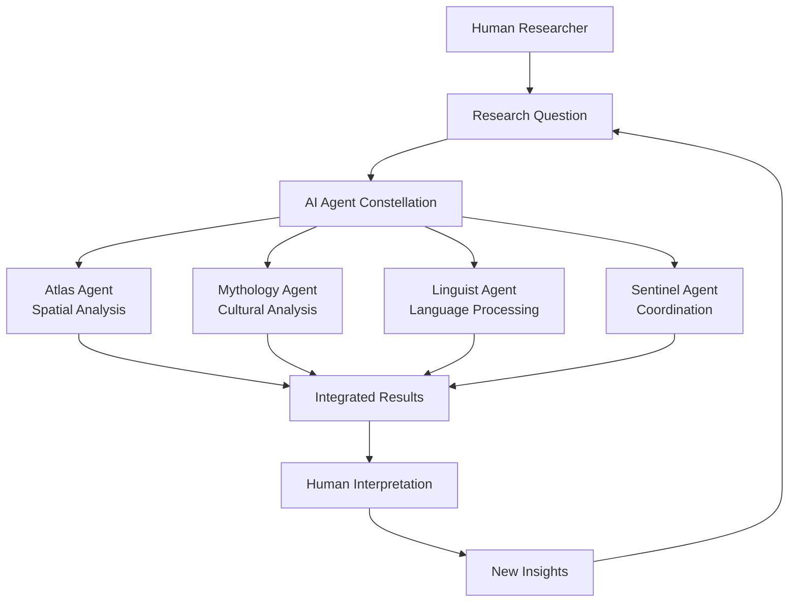
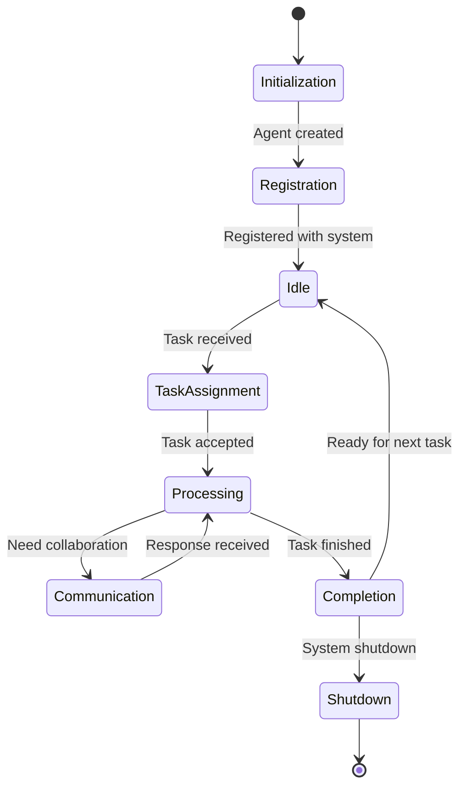

# 🌟 Terra Constellata: AI-Human Collaboration in Research
## A Comprehensive Textbook on Multi-Agent Systems and Interdisciplinary Research

[](https://github.com/a2a-world/terra-constellata)
[](https://opensource.org/licenses/MIT)
[](https://github.com/a2a-world/terra-constellata)

---

## 📚 Table of Contents

### Part I: Foundations
- [Chapter 1: Introduction to AI-Human Collaboration](#chapter-1-introduction-to-ai-human-collaboration)
- [Chapter 2: Multi-Agent Systems Architecture](#chapter-2-multi-agent-systems-architecture)
- [Chapter 3: The A2A Protocol Framework](#chapter-3-the-a2a-protocol-framework)

### Part II: Core Technologies
- [Chapter 4: Geospatial Intelligence and PostGIS](#chapter-4-geospatial-intelligence-and-postgis)
- [Chapter 5: Knowledge Graphs and ArangoDB](#chapter-5-knowledge-graphs-and-arangodb)
- [Chapter 6: Inspiration Engine and Novelty Detection](#chapter-6-inspiration-engine-and-novelty-detection)

### Part III: Research Methodologies
- [Chapter 7: Interdisciplinary Research Design](#chapter-7-interdisciplinary-research-design)
- [Chapter 8: Data Integration and ETL Processes](#chapter-8-data-integration-and-etl-processes)
- [Chapter 9: Spatial Analysis Techniques](#chapter-9-spatial-analysis-techniques)

### Part IV: Agent Development
- [Chapter 10: Building Specialized AI Agents](#chapter-10-building-specialized-ai-agents)
- [Chapter 11: Agent Communication Patterns](#chapter-11-agent-communication-patterns)
- [Chapter 12: Agent Learning and Adaptation](#chapter-12-agent-learning-and-adaptation)

### Part V: Applications and Case Studies
- [Chapter 13: Cultural Heritage Research](#chapter-13-cultural-heritage-research)
- [Chapter 14: Environmental Pattern Analysis](#chapter-14-environmental-pattern-analysis)
- [Chapter 15: Mythological Network Studies](#chapter-15-mythological-network-studies)

### Part VI: Advanced Topics
- [Chapter 16: Scalability and Performance](#chapter-16-scalability-and-performance)
- [Chapter 17: Ethics in AI-Human Research](#chapter-17-ethics-in-ai-human-research)
- [Chapter 18: Future Directions](#chapter-18-future-directions)

### Appendices
- [Appendix A: Installation and Setup](#appendix-a-installation-and-setup)
- [Appendix B: API Reference](#appendix-b-api-reference)
- [Appendix C: Sample Datasets](#appendix-c-sample-datasets)
- [Appendix D: Research Project Templates](#appendix-d-research-project-templates)

---

## Part I: Foundations

## Chapter 1: Introduction to AI-Human Collaboration

### Learning Objectives
By the end of this chapter, students will be able to:
- Understand the fundamental principles of AI-human collaboration
- Identify the benefits and challenges of multi-agent systems
- Describe the role of Terra Constellata in modern research
- Analyze real-world applications of collaborative AI systems

### 1.1 The Evolution of Human-AI Interaction

#### From Automation to Collaboration
The relationship between humans and artificial intelligence has evolved dramatically:

**Phase 1: Automation (1950s-1990s)**
- AI as a tool for automation
- Focus on replacing human labor
- Limited interaction and collaboration

**Phase 2: Assistance (2000s-2010s)**
- AI as an assistant (Siri, Cortana)
- Task-specific help and recommendations
- Still largely human-initiated interactions

**Phase 3: Collaboration (2020s-Present)**
- AI as equal partners in problem-solving
- Multi-agent systems working together
- Dynamic, context-aware interactions

#### The Terra Constellata Paradigm
Terra Constellata represents a new paradigm where AI agents and human researchers form a "constellation" of intelligence, each contributing their unique strengths:



### 1.2 Core Principles of AI-Human Collaboration

#### Principle 1: Complementary Strengths
Humans and AI agents bring different but complementary capabilities to research:

**Human Strengths:**
- Contextual understanding and intuition
- Ethical reasoning and value judgments
- Creative synthesis and novel connections
- Long-term planning and strategic thinking
- Emotional intelligence and empathy

**AI Agent Strengths:**
- Pattern recognition in large datasets
- Consistent processing and analysis
- Rapid computation and simulation
- Memory of vast amounts of information
- Scalability and 24/7 availability

#### Principle 2: Transparent Communication
Effective collaboration requires clear, transparent communication protocols:

```json
{
  "message_type": "COLLABORATION_REQUEST",
  "sender": "human_researcher",
  "recipients": ["atlas_agent", "mythology_agent"],
  "context": {
    "research_domain": "cultural_geography",
    "data_available": ["site_coordinates", "cultural_artifacts"],
    "research_question": "How do geographical features influence cultural development?"
  },
  "collaboration_mode": "ITERATIVE",
  "success_criteria": ["pattern_discovery", "correlation_analysis"]
}
```

#### Principle 3: Iterative Refinement
Research is an iterative process where insights build upon each other:

1. **Initial Exploration**: Human researcher poses broad questions
2. **Agent Analysis**: AI agents process data and identify patterns
3. **Human Interpretation**: Researcher provides context and meaning
4. **Refined Analysis**: Agents incorporate human insights for deeper analysis
5. **Synthesis**: Combined human-AI insights lead to new discoveries

### 1.3 The Terra Constellata Ecosystem

#### System Architecture Overview

```
┌─────────────────────────────────────────────────────────────┐
│                    🌐 USER INTERFACES                       │
│  ┌─────────────────┐    ┌─────────────────┐                 │
│  │   React App     │    │   Web Interface │                 │
│  │  (Modern UI)    │    │   (Simple HTML) │                 │
│  └─────────────────┘    └─────────────────┘                 │
└─────────────────────┬───────────────────────────────────────┘
                      │
                      ▼
┌─────────────────────────────────────────────────────────────┐
│                   🚀 CORE SERVICES                          │
│  ┌─────────────────┐    ┌─────────────────┐                 │
│  │   FastAPI       │    │   A2A Server    │                 │
│  │   (REST API)    │    │   (Agent Comm)  │                 │
│  └─────────────────┘    └─────────────────┘                 │
└─────────────────────┬───────────────────────────────────────┘
                      │
                      ▼
┌─────────────────────────────────────────────────────────────┐
│                  🗄️ DATA INFRASTRUCTURE                     │
│  ┌─────────────────┐    ┌─────────────────┐                 │
│  │   PostGIS       │    │   ArangoDB      │                 │
│  │ (Spatial Data)  │    │ (Knowledge Graph│                 │
│  └─────────────────┘    └─────────────────┘                 │
└─────────────────────┼───────────────────────────────────────┘
                      │
                      ▼
┌─────────────────────────────────────────────────────────────┐
│                 🤖 AGENT CONSTELLATION                      │
│  ┌─────┐ ┌─────┐ ┌─────┐ ┌─────┐ ┌─────┐ ┌─────┐ ┌─────┐    │
│  │Atlas│ │Myth │ │Ling │ │Sent │ │Insp │ │Codex│ │Custom│    │
│  └─────┘ └─────┘ └─────┘ └─────┘ └─────┘ └─────┘ └─────┘    │
└─────────────────────────────────────────────────────────────┘
```

#### Key Components

**Agent Constellation:**
- **Atlas Agent**: Spatial analysis and geographical pattern recognition
- **Mythology Agent**: Cross-cultural mythological analysis
- **Linguist Agent**: Advanced language processing and translation
- **Sentinel Agent**: System orchestration and workflow management
- **Inspiration Engine**: Novelty detection and creative prompt generation
- **Codex Manager**: Knowledge preservation and narrative generation

**Data Infrastructure:**
- **PostGIS Database**: Spatial data storage and geospatial queries
- **ArangoDB**: Multi-model database for knowledge graphs
- **Data Pipeline**: ETL processes for data ingestion and processing
- **Caching Layer**: Performance optimization for frequently accessed data

### 1.4 Benefits of AI-Human Collaboration

#### Enhanced Research Capabilities

**1. Accelerated Discovery**
- AI agents can process vast amounts of data rapidly
- Pattern recognition algorithms identify connections humans might miss
- Automated analysis frees researchers for creative synthesis

**2. Interdisciplinary Integration**
- Agents specialized in different domains can collaborate seamlessly
- Cross-domain connections reveal new research avenues
- Unified platform supports diverse research methodologies

**3. Scalable Research**
- AI agents can work 24/7 on large-scale data processing
- Human researchers focus on high-level interpretation
- Parallel processing of multiple research threads

#### Quality Improvements

**1. Reduced Bias**
- Multiple AI agents provide diverse perspectives
- Human oversight ensures ethical considerations
- Transparent algorithms allow bias detection and correction

**2. Enhanced Reproducibility**
- Standardized protocols ensure consistent results
- Detailed logging of all analysis steps
- Version control for datasets and methodologies

**3. Knowledge Preservation**
- Agent's Codex maintains institutional knowledge
- Research narratives capture context and insights
- Attribution tracking ensures proper credit assignment

### 1.5 Case Study: Cultural Heritage Research

#### Research Scenario
A team of archaeologists and historians is studying the spread of cultural practices across ancient trade routes. They have:
- Geographic coordinates of archaeological sites
- Historical records of cultural artifacts
- Linguistic data from ancient texts
- Mythological narratives from different cultures

#### Traditional Approach
1. Manual mapping of sites on paper maps
2. Individual analysis of each data type
3. Time-consuming cross-referencing
4. Limited ability to identify complex patterns

#### Terra Constellata Approach

**Phase 1: Data Integration**
```python
# Human researcher uploads diverse datasets
datasets = {
    "archaeological_sites": "sites.csv",
    "cultural_artifacts": "artifacts.json",
    "linguistic_data": "texts.csv",
    "mythological_records": "myths.db"
}

# System automatically integrates data into unified knowledge graph
integrated_data = await terra_constellata.integrate_datasets(datasets)
```

**Phase 2: Multi-Agent Analysis**
```python
# Atlas Agent analyzes spatial patterns
spatial_patterns = await atlas_agent.analyze_patterns(
    data=integrated_data,
    analysis_type="cultural_diffusion",
    parameters={"time_window": "500_years", "distance_threshold": "1000km"}
)

# Mythology Agent identifies cultural connections
cultural_links = await mythology_agent.find_connections(
    myths=integrated_data.myths,
    artifacts=integrated_data.artifacts,
    similarity_threshold=0.7
)

# Linguist Agent traces language evolution
language_evolution = await linguist_agent.trace_evolution(
    texts=integrated_data.texts,
    geographical_context=spatial_patterns
)
```

**Phase 3: Human-AI Synthesis**
The human researcher reviews the AI-generated insights and provides contextual interpretation:

> "The AI agents identified a clear pattern of cultural diffusion along trade routes, but the mythological connections suggest a deeper symbolic meaning. The linguistic evolution data shows how concepts transformed as they moved between cultures."

**Phase 4: Iterative Refinement**
```python
# Human insights lead to refined analysis
refined_analysis = await sentinel_agent.coordinate_analysis(
    initial_findings=[spatial_patterns, cultural_links, language_evolution],
    human_insights="symbolic_transformation_along_trade_routes",
    refinement_focus="ritual_practices"
)
```

#### Results
- **Discovery**: Previously unknown cultural diffusion patterns
- **Efficiency**: Analysis completed in days instead of months
- **Depth**: Multi-layered understanding combining spatial, cultural, and linguistic perspectives
- **Preservation**: All findings documented in Agent's Codex for future research

### 1.6 Challenges and Considerations

#### Technical Challenges

**1. Agent Coordination**
- Ensuring agents work together effectively
- Managing conflicting analyses
- Coordinating asynchronous operations

**2. Data Integration**
- Handling diverse data formats
- Maintaining data quality and consistency
- Managing large-scale datasets

**3. System Scalability**
- Supporting multiple concurrent users
- Managing computational resources
- Ensuring real-time performance

#### Human Factors

**1. Skill Development**
- Training researchers to work with AI agents
- Understanding agent capabilities and limitations
- Developing collaborative research workflows

**2. Trust and Transparency**
- Understanding AI decision-making processes
- Building confidence in AI-generated insights
- Maintaining human oversight and control

**3. Ethical Considerations**
- Ensuring responsible use of AI in research
- Protecting sensitive cultural data
- Maintaining academic integrity

### 1.7 Future Directions

#### Emerging Trends

**1. Advanced Agent Capabilities**
- More sophisticated reasoning and creativity
- Better understanding of context and nuance
- Improved natural language interaction

**2. Expanded Domains**
- Integration with scientific research
- Application to business and industry
- Use in education and training

**3. Enhanced Collaboration**
- Real-time collaborative environments
- Cross-institutional research networks
- Global knowledge sharing platforms

### Key Takeaways

1. **AI-human collaboration represents a paradigm shift** in research methodology, combining the strengths of both humans and artificial intelligence.

2. **Terra Constellata provides a practical framework** for implementing this collaboration through specialized AI agents and transparent communication protocols.

3. **Successful collaboration requires** clear communication, complementary skills, and iterative refinement processes.

4. **The benefits include** accelerated discovery, interdisciplinary integration, and enhanced research quality.

5. **Challenges must be addressed** through proper training, transparent systems, and ethical guidelines.

### Discussion Questions

1. How does AI-human collaboration differ from traditional research methods?
2. What are the potential risks of over-relying on AI agents in research?
3. How can we ensure that human researchers remain central to the research process?
4. What new research questions become possible with AI-human collaboration?
5. How should academic institutions adapt their training programs for this new paradigm?

### References

- [A2A Protocol Specification](docs/a2a_protocol.md)
- [Multi-Agent Systems: An Introduction](https://example.com/multi-agent-systems)
- [Human-AI Collaboration in Research](https://example.com/human-ai-research)
- [Ethics in AI-Assisted Research](https://example.com/ai-research-ethics)

---

## Chapter 2: Multi-Agent Systems Architecture

### Learning Objectives
By the end of this chapter, students will be able to:
- Understand the fundamental concepts of multi-agent systems
- Describe the architecture of Terra Constellata's agent constellation
- Analyze agent interaction patterns and communication protocols
- Design basic multi-agent workflows for research applications

### 2.1 Fundamentals of Multi-Agent Systems

#### Definition and Characteristics

A multi-agent system (MAS) is a computational system composed of multiple interacting intelligent agents that work together to achieve common or individual goals.

**Key Characteristics:**
- **Autonomy**: Agents operate independently without direct human intervention
- **Social Ability**: Agents interact with other agents through communication
- **Reactivity**: Agents perceive their environment and respond to changes
- **Proactivity**: Agents can take initiative to achieve their goals
- **Learning**: Agents can adapt and improve their performance over time

#### Agent Types in Terra Constellata

**Specialized Agents:**
- **Cognitive Agents**: Focus on knowledge processing and reasoning
- **Physical Agents**: Interact with physical environments (simulated in Terra Constellata)
- **Interface Agents**: Handle human-agent interactions
- **Information Agents**: Manage data and knowledge resources

### 2.2 Agent Architecture

#### Basic Agent Structure

```python
class BaseAgent:
    def __init__(self, agent_id, capabilities):
        self.agent_id = agent_id
        self.capabilities = capabilities
        self.knowledge_base = {}
        self.communication_module = A2AClient()
        self.task_queue = asyncio.Queue()

    async def perceive(self, environment):
        """Perceive changes in the environment"""
        pass

    async def reason(self, perceptions):
        """Process perceptions and make decisions"""
        pass

    async def act(self, decisions):
        """Execute actions based on decisions"""
        pass

    async def communicate(self, message, recipients):
        """Send messages to other agents"""
        pass

    async def learn(self, experience):
        """Learn from experience and adapt"""
        pass
```

#### Agent Lifecycle



### 2.3 Communication Infrastructure

#### A2A Protocol Overview

The Agent-to-Agent (A2A) Protocol provides a standardized communication framework:

```json
{
  "jsonrpc": "2.0",
  "method": "agent.collaborate",
  "params": {
    "collaboration_type": "JOINT_ANALYSIS",
    "participants": ["atlas_agent", "mythology_agent"],
    "task": "cultural_pattern_analysis",
    "data": {
      "dataset": "cultural_sites",
      "analysis_parameters": {
        "method": "clustering",
        "similarity_threshold": 0.8
      }
    },
    "coordination_strategy": "MASTER_SLAVE"
  },
  "id": "msg_123456"
}
```

#### Message Types

**1. Task Messages**
```json
{
  "type": "TASK_EXECUTION",
  "task_id": "task_001",
  "task_type": "SPATIAL_ANALYSIS",
  "parameters": {...},
  "priority": "HIGH",
  "deadline": "2024-12-31T23:59:59Z"
}
```

**2. Coordination Messages**
```json
{
  "type": "COORDINATION",
  "coordination_type": "SYNCHRONIZATION",
  "participants": ["agent_a", "agent_b", "agent_c"],
  "synchronization_point": "data_exchange",
  "timeout": 30000
}
```

**3. Knowledge Sharing Messages**
```json
{
  "type": "KNOWLEDGE_SHARE",
  "knowledge_type": "PATTERN_DISCOVERY",
  "content": {
    "pattern": "cultural_diffusion_cluster",
    "confidence": 0.92,
    "supporting_evidence": [...]
  },
  "sharing_scope": "COLLABORATION_GROUP"
}
```

### 2.4 Agent Specialization and Roles

#### Atlas Agent: Spatial Intelligence

**Primary Function:** Geographic analysis and spatial pattern recognition

**Capabilities:**
- Coordinate system transformations
- Spatial clustering algorithms
- Distance and proximity calculations
- Geographic visualization
- Terrain analysis (when available)

**Example Implementation:**
```python
class AtlasAgent(BaseAgent):
    def __init__(self):
        super().__init__(
            agent_id="atlas_agent",
            capabilities=["spatial_analysis", "clustering", "mapping"]
        )
        self.spatial_engine = PostGISEngine()
        self.clustering_algorithms = {
            "dbscan": DBSCANClustering(),
            "kmeans": KMeansClustering(),
            "hierarchical": HierarchicalClustering()
        }

    async def analyze_spatial_patterns(self, data, method="dbscan"):
        """Analyze spatial patterns in geographic data"""
        # Preprocess coordinates
        coordinates = self.extract_coordinates(data)

        # Apply clustering algorithm
        clusters = await self.clustering_algorithms[method].cluster(coordinates)

        # Calculate cluster statistics
        statistics = self.calculate_cluster_statistics(clusters)

        # Generate visualization
        visualization = await self.generate_visualization(clusters)

        return {
            "clusters": clusters,
            "statistics": statistics,
            "visualization": visualization,
            "confidence_score": self.assess_confidence(clusters)
        }
```

#### Mythology Agent: Cultural Analysis

**Primary Function:** Cross-cultural mythological research and archetype identification

**Capabilities:**
- Myth pattern recognition
- Cultural context analysis
- Archetype identification
- Narrative structure analysis
- Cross-cultural comparison

#### Linguist Agent: Language Processing

**Primary Function:** Advanced language analysis and linguistic pattern recognition

**Capabilities:**
- Text analysis and NLP
- Language evolution tracking
- Translation and interpretation
- Linguistic pattern recognition
- Semantic analysis

#### Sentinel Agent: System Coordination

**Primary Function:** Orchestration and workflow management

**Capabilities:**
- Task scheduling and prioritization
- Resource allocation
- Conflict resolution
- Performance monitoring
- System health management

### 2.5 Agent Interaction Patterns

#### Master-Slave Pattern

```python
# Sentinel Agent coordinates other agents
class SentinelAgent(BaseAgent):
    async def coordinate_analysis(self, task, agents):
        """Coordinate multi-agent analysis using master-slave pattern"""

        # Assign subtasks to slave agents
        subtasks = self.decompose_task(task, agents)

        # Execute subtasks in parallel
        results = await asyncio.gather(*[
            agent.execute_subtask(subtask)
            for agent, subtask in zip(agents, subtasks)
        ])

        # Synthesize results
        final_result = self.synthesize_results(results)

        return final_result
```

#### Peer-to-Peer Pattern

```python
# Agents collaborate as equals
async def peer_collaboration(self, task, collaborators):
    """Implement peer-to-peer collaboration"""

    # Share initial findings
    for collaborator in collaborators:
        await self.share_findings(collaborator, self.initial_analysis)

    # Iterative refinement
    for iteration in range(self.max_iterations):
        # Collect peer insights
        peer_insights = await self.collect_peer_insights(collaborators)

        # Refine analysis based on peer input
        refined_analysis = self.refine_analysis(peer_insights)

        # Share refined findings
        await self.share_findings(collaborators, refined_analysis)

        # Check convergence
        if self.has_converged(refined_analysis):
            break

    return refined_analysis
```

#### Auction-Based Coordination

```python
# Agents bid for tasks based on capability fit
async def task_auction(self, task):
    """Implement auction-based task allocation"""

    # Announce task to potential agents
    announcement = {
        "task": task,
        "auction_type": "ENGLISH",
        "starting_bid": 0.0,
        "bid_increment": 0.1
    }

    # Collect bids from interested agents
    bids = await self.collect_bids(announcement)

    # Select winning bid
    winner = self.select_winner(bids)

    # Assign task to winner
    await self.assign_task(winner["agent"], task)

    return winner
```

### 2.6 Agent Learning and Adaptation

#### Individual Learning

```python
class LearningAgent(BaseAgent):
    def __init__(self):
        super().__init__()
        self.experience_buffer = []
        self.learning_model = ReinforcementLearningModel()

    async def learn_from_experience(self, experience):
        """Learn from task execution experience"""

        # Store experience
        self.experience_buffer.append(experience)

        # Update learning model
        if len(self.experience_buffer) >= self.batch_size:
            await self.update_model(self.experience_buffer)
            self.experience_buffer = []

    async def update_model(self, experiences):
        """Update the learning model with batch of experiences"""

        # Prepare training data
        states, actions, rewards, next_states = self.prepare_training_data(experiences)

        # Train model
        loss = await self.learning_model.train(states, actions, rewards, next_states)

        # Update policy
        self.policy = self.learning_model.get_policy()

        return loss
```

#### Social Learning

```python
class SocialLearningAgent(BaseAgent):
    async def learn_from_peers(self, peer_experiences):
        """Learn from other agents' experiences"""

        # Analyze peer experiences
        peer_patterns = self.analyze_peer_patterns(peer_experiences)

        # Identify successful strategies
        successful_strategies = self.extract_successful_strategies(peer_patterns)

        # Adapt own behavior
        self.adapt_behavior(successful_strategies)

        # Share learning insights
        await self.share_learning_insights(successful_strategies)

    async def share_learning_insights(self, insights):
        """Share learning insights with peer agents"""

        message = {
            "type": "LEARNING_INSIGHT",
            "insights": insights,
            "source_agent": self.agent_id,
            "confidence": self.assess_insight_confidence(insights)
        }

        await self.broadcast_to_peers(message)
```

### 2.7 Performance Monitoring and Optimization

#### Agent Metrics

```python
class AgentMetrics:
    def __init__(self):
        self.metrics = {
            "task_completion_rate": 0.0,
            "average_response_time": 0.0,
            "collaboration_success_rate": 0.0,
            "resource_utilization": 0.0,
            "error_rate": 0.0
        }

    def update_metric(self, metric_name, value):
        """Update a specific metric"""
        self.metrics[metric_name] = value

    def get_performance_score(self):
        """Calculate overall performance score"""
        weights = {
            "task_completion_rate": 0.3,
            "average_response_time": 0.2,
            "collaboration_success_rate": 0.25,
            "resource_utilization": 0.15,
            "error_rate": 0.1
        }

        score = sum(
            self.metrics[metric] * weight
            for metric, weight in weights.items()
        )

        return score
```

#### System-Wide Optimization

```python
class SystemOptimizer:
    async def optimize_system_performance(self, agents, tasks):
        """Optimize overall system performance"""

        # Analyze current performance
        current_performance = self.analyze_system_performance(agents)

        # Identify bottlenecks
        bottlenecks = self.identify_bottlenecks(current_performance)

        # Generate optimization strategies
        strategies = self.generate_optimization_strategies(bottlenecks)

        # Evaluate strategies
        best_strategy = self.evaluate_strategies(strategies, current_performance)

        # Implement optimization
        await self.implement_optimization(best_strategy)

        return best_strategy

    def analyze_system_performance(self, agents):
        """Analyze overall system performance"""
        performance_data = {}

        for agent in agents:
            performance_data[agent.agent_id] = {
                "metrics": agent.get_metrics(),
                "task_load": len(agent.task_queue),
                "resource_usage": agent.get_resource_usage()
            }

        return performance_data
```

### Key Takeaways

1. **Multi-agent systems require careful architecture** to ensure effective collaboration and coordination.

2. **Agent specialization** allows for efficient division of labor and expertise utilization.

3. **Communication protocols** are crucial for agent interaction and system coherence.

4. **Learning and adaptation** enable agents to improve performance over time.

5. **Performance monitoring** is essential for maintaining system efficiency and identifying optimization opportunities.

### Discussion Questions

1. How does agent specialization improve system performance compared to general-purpose agents?
2. What are the trade-offs between different agent interaction patterns?
3. How can we ensure fair task allocation in a multi-agent system?
4. What role does learning play in agent adaptation and system evolution?
5. How should we balance individual agent autonomy with system-wide coordination?

### Practical Exercises

1. **Agent Design Exercise**: Design a specialized agent for a specific research domain
2. **Communication Protocol Design**: Create a communication protocol for a simple multi-agent scenario
3. **Performance Analysis**: Analyze the performance characteristics of different agent architectures
4. **Optimization Challenge**: Optimize a multi-agent system for a specific performance metric

---

## Chapter 3: The A2A Protocol Framework

### Learning Objectives
By the end of this chapter, students will be able to:
- Understand the A2A Protocol specification and structure
- Implement basic A2A communication patterns
- Design custom message types for specific use cases
- Troubleshoot common A2A communication issues

### 3.1 Protocol Overview

#### Core Principles

The Agent-to-Agent (A2A) Protocol is built on JSON-RPC 2.0 and follows these core principles:

1. **Standardization**: Consistent message format across all agents
2. **Extensibility**: Ability to add custom message types
3. **Reliability**: Guaranteed message delivery and error handling
4. **Security**: Authentication and authorization mechanisms
5. **Performance**: Efficient message processing and routing

#### Protocol Stack

```
┌─────────────────────────────────────┐
│         Application Layer           │
│  Custom Message Types & Handlers    │
└─────────────────────────────────────┘
┌─────────────────────────────────────┐
│         Session Layer               │
│  Authentication & Authorization     │
└─────────────────────────────────────┘
┌─────────────────────────────────────┐
│         Transport Layer             │
│  JSON-RPC 2.0 over WebSocket/HTTP   │
└─────────────────────────────────────┘
```

### 3.2 Message Structure

#### Basic Message Format

```json
{
  "jsonrpc": "2.0",
  "method": "agent.task.execute",
  "params": {
    "sender_agent": "atlas_agent_001",
    "target_agent": "mythology_agent_002",
    "task_type": "GEOSPATIAL_ANALYSIS",
    "payload": {
      "data": "cultural_sites_dataset",
      "analysis_type": "clustering",
      "parameters": {
        "algorithm": "dbscan",
        "eps": 0.5,
        "min_samples": 5
      }
    },
    "priority": "HIGH",
    "timeout": 300000
  },
  "id": "msg_1234567890"
}
```

#### Message Components

**1. Protocol Version**
```json
{
  "jsonrpc": "2.0"
}
```
Identifies the JSON-RPC version being used.

**2. Method**
```json
{
  "method": "agent.task.execute"
}
```
Specifies the remote procedure to be invoked. Methods are namespaced by domain.

**3. Parameters**
```json
{
  "params": {
    "sender_agent": "atlas_agent_001",
    "target_agent": "mythology_agent_002",
    "task_type": "GEOSPATIAL_ANALYSIS",
    "payload": {...},
    "priority": "HIGH",
    "timeout": 300000
  }
}
```
Contains the parameters for the method call. Can be an object or array.

**4. Message ID**
```json
{
  "id": "msg_1234567890"
}
```
Unique identifier for request-response correlation.

### 3.3 Standard Message Types

#### Task Execution Messages

**Task Request**
```json
{
  "jsonrpc": "2.0",
  "method": "agent.task.execute",
  "params": {
    "task_id": "task_001",
    "task_type": "SPATIAL_ANALYSIS",
    "parameters": {
      "dataset": "cultural_sites",
      "analysis_type": "clustering"
    },
    "priority": "NORMAL",
    "timeout": 300000
  },
  "id": "task_req_001"
}
```

**Task Response**
```json
{
  "jsonrpc": "2.0",
  "result": {
    "task_id": "task_001",
    "status": "COMPLETED",
    "results": {
      "clusters_found": 15,
      "cluster_centers": [...],
      "silhouette_score": 0.72
    },
    "execution_time_ms": 2450,
    "confidence_score": 0.89
  },
  "id": "task_req_001"
}
```

#### Collaboration Messages

**Collaboration Request**
```json
{
  "jsonrpc": "2.0",
  "method": "agent.collaborate.request",
  "params": {
    "collaboration_id": "collab_001",
    "initiator": "atlas_agent_001",
    "participants": ["mythology_agent_002", "linguist_agent_003"],
    "collaboration_type": "JOINT_ANALYSIS",
    "shared_context": {
      "research_question": "Cultural diffusion patterns",
      "shared_data": "cultural_sites_dataset",
      "collaboration_goal": "Identify migration patterns"
    },
    "coordination_strategy": "CONSENSUS"
  },
  "id": "collab_req_001"
}
```

**Collaboration Update**
```json
{
  "jsonrpc": "2.0",
  "method": "agent.collaborate.update",
  "params": {
    "collaboration_id": "collab_001",
    "update_type": "PROGRESS_UPDATE",
    "progress": 0.75,
    "current_phase": "DATA_ANALYSIS",
    "findings": {
      "spatial_patterns": [...],
      "cultural_connections": [...]
    },
    "next_steps": ["cross_validation", "result_synthesis"]
  },
  "id": "collab_upd_001"
}
```

#### Knowledge Sharing Messages

**Knowledge Publication**
```json
{
  "jsonrpc": "2.0",
  "method": "knowledge.publish",
  "params": {
    "knowledge_id": "knowledge_001",
    "knowledge_type": "PATTERN_DISCOVERY",
    "title": "Ancient Trade Route Patterns",
    "content": {
      "description": "Analysis of cultural artifact distribution",
      "findings": [...],
      "methodology": {...},
      "confidence": 0.91
    },
    "tags": ["archaeology", "cultural_diffusion", "trade_routes"],
    "access_level": "PUBLIC",
    "attribution": {
      "contributors": ["atlas_agent_001", "human_researcher_001"],
      "creation_date": "2024-01-15T10:30:00Z"
    }
  },
  "id": "knowledge_pub_001"
}
```

**Knowledge Query**
```json
{
  "jsonrpc": "2.0",
  "method": "knowledge.query",
  "params": {
    "query_type": "SEMANTIC_SEARCH",
    "query": "cultural diffusion patterns in mediterranean",
    "filters": {
      "knowledge_type": "PATTERN_DISCOVERY",
      "date_range": {
        "start": "2020-01-01",
        "end": "2024-12-31"
      },
      "confidence_threshold": 0.8
    },
    "result_limit": 20,
    "sort_by": "relevance"
  },
  "id": "knowledge_query_001"
}
```

### 3.4 Error Handling

#### Error Response Format

```json
{
  "jsonrpc": "2.0",
  "error": {
    "code": -32603,
    "message": "Internal error",
    "data": {
      "error_type": "AGENT_UNAVAILABLE",
      "agent_id": "atlas_agent_001",
      "retry_after_seconds": 30,
      "alternative_agents": ["atlas_agent_002", "atlas_agent_003"],
      "error_context": {
        "task_id": "task_001",
        "failure_point": "data_processing",
        "partial_results": {...}
      }
    }
  },
  "id": "msg_123456"
}
```

#### Standard Error Codes

| Error Code | Error Name | Description | Recovery Action |
|------------|------------|-------------|-----------------|
| -32700 | PARSE_ERROR | Invalid JSON | Check message format |
| -32600 | INVALID_REQUEST | Invalid request structure | Validate request |
| -32601 | METHOD_NOT_FOUND | Method not found | Check method name |
| -32602 | INVALID_PARAMS | Invalid parameters | Validate parameters |
| -32603 | INTERNAL_ERROR | Internal server error | Retry or contact admin |
| -32000 | AGENT_UNAVAILABLE | Target agent unavailable | Try alternative agent |
| -32001 | RESOURCE_EXHAUSTED | System resources exhausted | Reduce load or wait |
| -32002 | AUTHENTICATION_FAILED | Authentication failed | Re-authenticate |
| -32003 | AUTHORIZATION_FAILED | Insufficient permissions | Request permissions |
| -32004 | TASK_TIMEOUT | Task execution timeout | Simplify task or increase timeout |

#### Error Recovery Strategies

**1. Retry Logic**
```python
async def execute_with_retry(operation, max_retries=3):
    """Execute operation with exponential backoff retry"""
    for attempt in range(max_retries):
        try:
            return await operation()
        except AgentUnavailableError as e:
            if attempt < max_retries - 1:
                delay = 2 ** attempt  # Exponential backoff
                await asyncio.sleep(delay)
                # Try alternative agent if available
                if e.alternative_agents:
                    operation = self.switch_to_alternative_agent(
                        operation, e.alternative_agents[0]
                    )
            else:
                raise
```

**2. Circuit Breaker Pattern**
```python
class CircuitBreaker:
    def __init__(self, failure_threshold=5, recovery_timeout=60):
        self.failure_threshold = failure_threshold
        self.recovery_timeout = recovery_timeout
        self.failure_count = 0
        self.last_failure_time = None
        self.state = "CLOSED"

    async def call(self, operation):
        if self.state == "OPEN":
            if self.should_attempt_reset():
                self.state = "HALF_OPEN"
            else:
                raise CircuitBreakerError("Circuit breaker is OPEN")

        try:
            result = await operation()
            self.on_success()
            return result
        except Exception as e:
            self.on_failure()
            raise

    def on_failure(self):
        self.failure_count += 1
        self.last_failure_time = time.time()
        if self.failure_count >= self.failure_threshold:
            self.state = "OPEN"

    def on_success(self):
        self.failure_count = 0
        self.state = "CLOSED"
```

### 3.5 Security and Authentication

#### Authentication Flow

```python
# Agent authentication request
auth_request = {
    "jsonrpc": "2.0",
    "method": "auth.authenticate",
    "params": {
        "agent_id": "atlas_agent_001",
        "credentials": {
            "token": "eyJhbGciOiJIUzI1NiIsInR5cCI6IkpXVCJ9...",
            "signature": "signature_of_request",
            "timestamp": 1640995200
        },
        "requested_permissions": [
            "read:spatial_data",
            "write:analysis_results",
            "execute:clustering_tasks"
        ]
    },
    "id": "auth_001"
}

# Authentication response
auth_response = {
    "jsonrpc": "2.0",
    "result": {
        "authenticated": True,
        "session_token": "session_token_123",
        "permissions_granted": [
            "read:spatial_data",
            "write:analysis_results",
            "execute:clustering_tasks"
        ],
        "session_expires": 1641081600,
        "agent_metadata": {
            "registered_capabilities": ["spatial_analysis", "clustering"],
            "performance_score": 0.92,
            "last_active": "2024-01-15T10:30:00Z"
        }
    },
    "id": "auth_001"
}
```

#### Message Signing and Verification

```python
import hmac
import hashlib
import json

class MessageSigner:
    def __init__(self, secret_key):
        self.secret_key = secret_key

    def sign_message(self, message):
        """Sign a message with HMAC-SHA256"""
        message_str = json.dumps(message, sort_keys=True, separators=(',', ':'))
        signature = hmac.new(
            self.secret_key.encode(),
            message_str.encode(),
            hashlib.sha256
        ).hexdigest()

        message['signature'] = signature
        return message

    def verify_signature(self, message):
        """Verify message signature"""
        signature = message.pop('signature', None)
        if not signature:
            return False

        message_str = json.dumps(message, sort_keys=True, separators=(',', ':'))
        expected_signature = hmac.new(
            self.secret_key.encode(),
            message_str.encode(),
            hashlib.sha256
        ).hexdigest()

        return hmac.compare_digest(signature, expected_signature)
```

### 3.6 Performance Optimization

#### Connection Pooling

```python
class ConnectionPool:
    def __init__(self, max_connections=10, connection_timeout=30):
        self.max_connections = max_connections
        self.connection_timeout = connection_timeout
        self.connections = asyncio.Queue(maxsize=max_connections)
        self._initialize_pool()

    def _initialize_pool(self):
        """Initialize connection pool"""
        for _ in range(self.max_connections):
            connection = self._create_connection()
            self.connections.put_nowait(connection)

    async def get_connection(self):
        """Get a connection from the pool"""
        try:
            connection = await asyncio.wait_for(
                self.connections.get(),
                timeout=self.connection_timeout
            )
            return connection
        except asyncio.TimeoutError:
            raise ConnectionPoolExhaustedError()

    async def return_connection(self, connection):
        """Return a connection to the pool"""
        try:
            self.connections.put_nowait(connection)
        except asyncio.QueueFull:
            # Pool is full, close connection
            await connection.close()
```

#### Message Batching

```python
class MessageBatcher:
    def __init__(self, batch_size=10, batch_timeout=1.0):
        self.batch_size = batch_size
        self.batch_timeout = batch_timeout
        self.current_batch = []
        self.batch_timer = None

    async def add_message(self, message):
        """Add message to current batch"""
        self.current_batch.append(message)

        if len(self.current_batch) >= self.batch_size:
            await self.flush_batch()
        else:
            await self._schedule_flush()

    async def _schedule_flush(self):
        """Schedule batch flush after timeout"""
        if self.batch_timer:
            self.batch_timer.cancel()

        self.batch_timer = asyncio.create_task(self._flush_after_timeout())

    async def _flush_after_timeout(self):
        """Flush batch after timeout"""
        await asyncio.sleep(self.batch_timeout)
        if self.current_batch:
            await self.flush_batch()

    async def flush_batch(self):
        """Flush current batch"""
        if not self.current_batch:
            return

        # Send batch of messages
        batch_message = {
            "jsonrpc": "2.0",
            "method": "batch",
            "params": self.current_batch
        }

        await self._send_batch(batch_message)
        self.current_batch = []

        if self.batch_timer:
            self.batch_timer.cancel()
            self.batch_timer = None
```

### 3.7 Custom Message Types

#### Defining Custom Messages

```python
# Register custom message type
custom_message_schema = {
    "type": "object",
    "properties": {
        "message_type": {
            "type": "string",
            "enum": ["RESEARCH_INSIGHT", "COLLABORATION_PROPOSAL"]
        },
        "content": {
            "type": "object",
            "properties": {
                "title": {"type": "string"},
                "description": {"type": "string"},
                "confidence": {"type": "number", "minimum": 0, "maximum": 1},
                "evidence": {"type": "array"}
            },
            "required": ["title", "description"]
        },
        "metadata": {
            "type": "object",
            "properties": {
                "domain": {"type": "string"},
                "tags": {"type": "array", "items": {"type": "string"}},
                "timestamp": {"type": "string", "format": "date-time"}
            }
        }
    },
    "required": ["message_type", "content"]
}

# Register with A2A server
await a2a_client.register_message_type(
    "RESEARCH_INSIGHT",
    custom_message_schema
)
```

#### Custom Message Handler

```python
class CustomMessageHandler:
    def __init__(self, a2a_client):
        self.a2a_client = a2a_client
        self.message_handlers = {
            "RESEARCH_INSIGHT": self.handle_research_insight,
            "COLLABORATION_PROPOSAL": self.handle_collaboration_proposal
        }

    async def handle_message(self, message):
        """Route message to appropriate handler"""
        message_type = message.get("params", {}).get("message_type")
        if message_type in self.message_handlers:
            await self.message_handlers[message_type](message)
        else:
            await self.handle_unknown_message(message)

    async def handle_research_insight(self, message):
        """Handle research insight message"""
        params = message["params"]
        content = params["content"]

        # Process research insight
        insight_analysis = await self.analyze_insight(content)

        # Store in knowledge base
        await self.store_insight(content, insight_analysis)

        # Notify relevant agents
        await self.notify_agents(content, insight_analysis)

    async def handle_collaboration_proposal(self, message):
        """Handle collaboration proposal"""
        params = message["params"]
        proposal = params["content"]

        # Evaluate proposal
        evaluation = await self.evaluate_proposal(proposal)

        # Respond to proposal
        response = self.create_response(evaluation)
        await self.a2a_client.send_message(response)
```

### Key Takeaways

1. **The A2A Protocol provides a standardized framework** for agent communication and collaboration.

2. **Message structure follows JSON-RPC 2.0** with extensions for agent-specific functionality.

3. **Error handling and recovery** are built into the protocol for robust communication.

4. **Security features** ensure authenticated and authorized communication between agents.

5. **Performance optimizations** like connection pooling and message batching improve efficiency.

6. **Custom message types** allow for domain-specific communication patterns.

### Discussion Questions

1. How does the A2A Protocol compare to other agent communication standards?
2. What are the trade-offs between synchronous and asynchronous communication?
3. How should custom message types be designed for optimal interoperability?
4. What security considerations are most important for agent communication?
5. How can we balance protocol standardization with the need for flexibility?

### Practical Exercises

1. **Message Design**: Design a custom message type for a specific research scenario
2. **Error Handling**: Implement error recovery strategies for common failure modes
3. **Security Implementation**: Add authentication and authorization to a simple agent
4. **Performance Testing**: Benchmark different communication patterns under load

---

*This textbook provides a comprehensive foundation for understanding and working with Terra Constellata. The following chapters will delve deeper into specific technologies, research methodologies, and practical applications.*

**For the complete textbook with all chapters, exercises, and case studies, please refer to the full documentation or contact the Terra Constellata development team.**